# Resources to learn Python:
- https://www.syntaxshift.dev/courses/from-java-to-python
- https://blu3r4y.github.io/python-for-java-developers/excerpt.html

# Gemini Learning
AI is good at 
- Looking at staging csv output by datagrip, then generating the code for dimension and fact table, it can look at common patterns in the data too
- Generating Python code that works, even when I don't know Python well
- Generating Python code from formula
- Generating Python code from Java

# Install anaconda & juypter notebook
- https://www.anaconda.com/download/success

[Data Sources](./screenshots/dataSources.png)

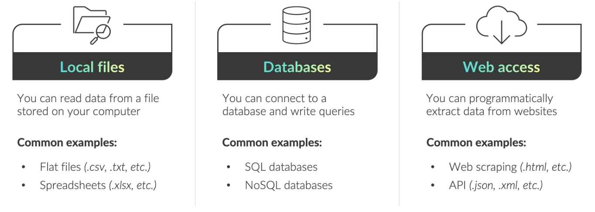

[Structure vs Unstructure](./screenshots/StructureVSUnstructure.png)


[Data Cleaning](./screenshots/dataCleaning.png)

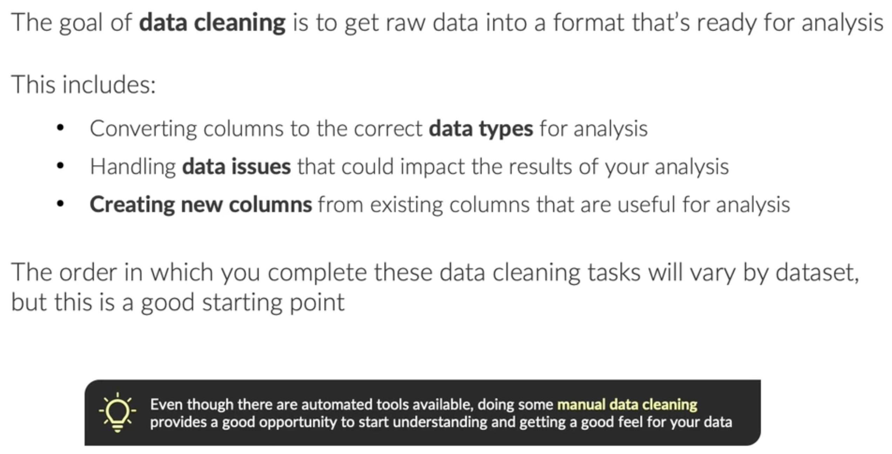

[Data Issues](./screenshots/dataIssues.png)

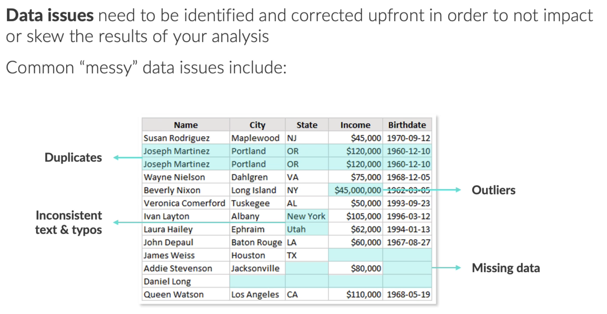

[Handle Missing Data](./screenshots/handleMissingData.png)

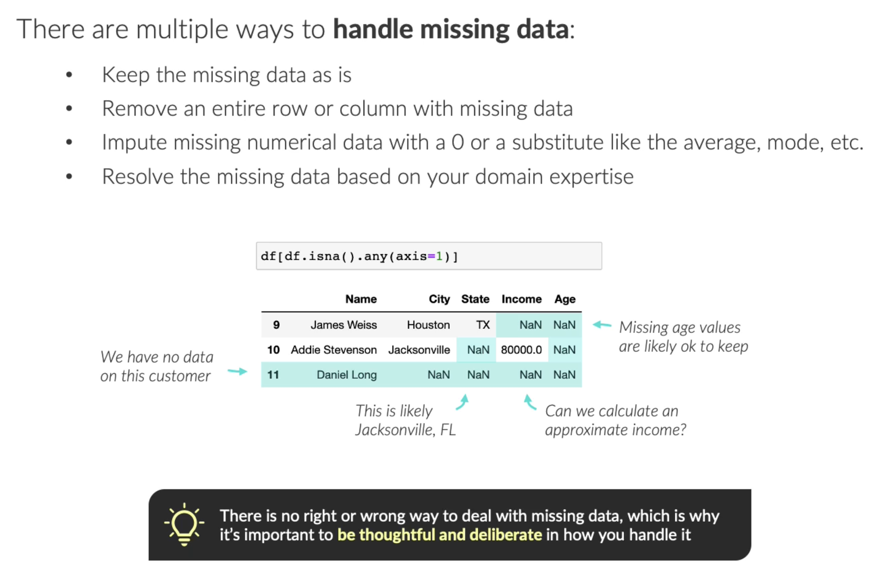

[Prices Missing Data](./screenshots/pricesMissingData.png)

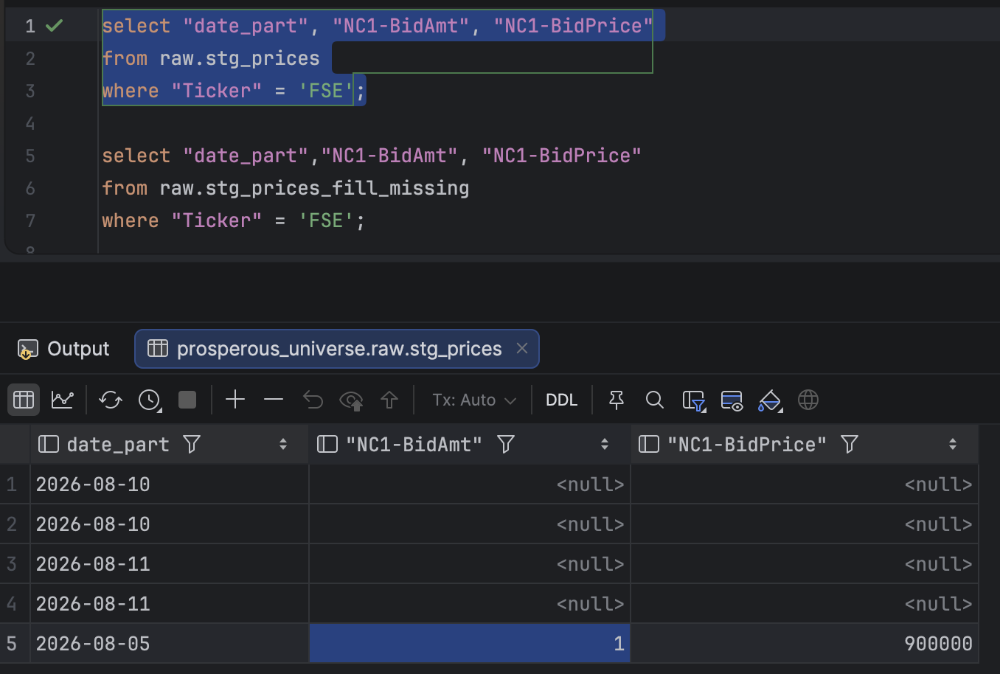

[Prices Missing Data Part 2](./screenshots/pricesMissingDataPart2.png)

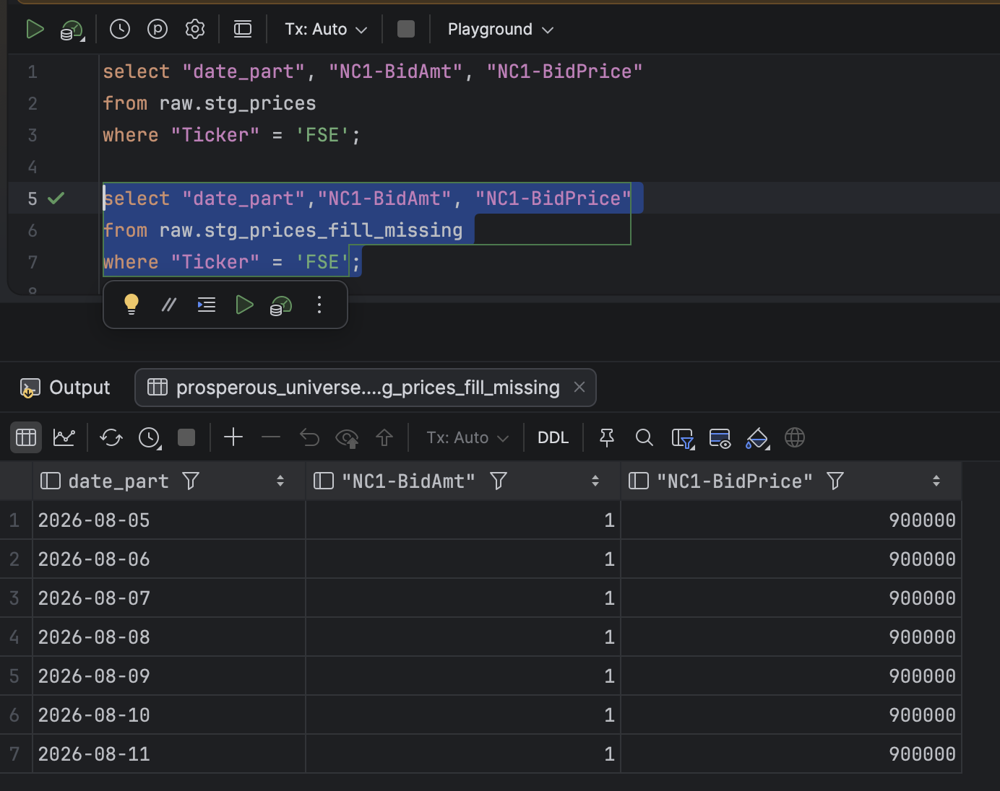

# Get Excel For free
Link to github repo:
- https://github.com/massgravel/Microsoft-Activation-Scripts

Link to website download for Mac Os:
- https://massgrave.dev/office_for_mac

# Learn Excel
| Excel Pivot Table Feature | SQL Equivalent | Description / Purpose |
| :--- | :--- | :--- |
| **Rows Area** | `GROUP BY column_name` | Defines the distinct row categories/buckets to group the raw data by. |
| **Values Area** | Aggregate Functions (`SUM()`, `COUNT()`, `AVG()`, `MAX()`, `MIN()`) | The numeric metrics calculated for each grouped bucket. |
| **Columns Area** | `PIVOT` clause OR Conditional Aggregation (`SUM(CASE WHEN ...)`) | Transposes distinct field values horizontally into separate column headers. |
| **Filters / Slicers** | `WHERE` clause | Filters raw underlying rows **before** any grouping or aggregation takes place. |
| **Value Filters** *(Label/Value Filters)* | `HAVING` clause | Filters the aggregated results **after** the grouping and calculations are complete. |
| **Calculated Field** | Computed Expression in `SELECT` (e.g., `SUM(Sales) * 0.10`) | Performs math on the aggregated values within the output query. |
| **Grand Totals / Subtotals** | `GROUP BY ROLLUP(...)` / `CUBE(...)` OR `UNION ALL` | Computes higher-level aggregate summaries across groups and the entire dataset. |

[Excel Pivot Table](./screenshots/ExcelPivotTable.png)

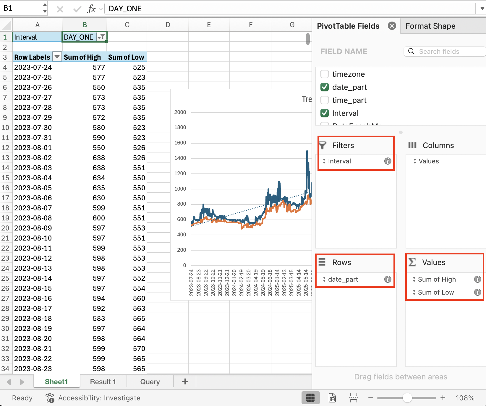

# Calculation for Prosperous Universe
[Profit Per Day](./screenshots/calculationProfitPerDay.png)

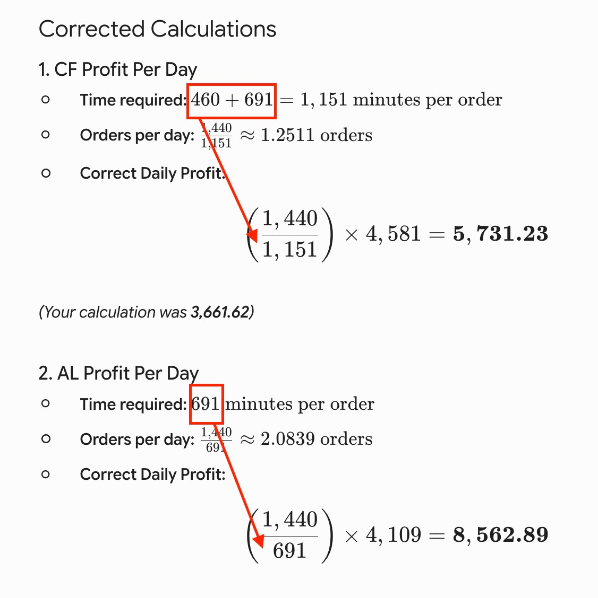

4109 for AL is buy minus sell profit
4581 for CL is buy minus sell profit

[Index Per Day Part 1](./screenshots/PartOneIndex.png)

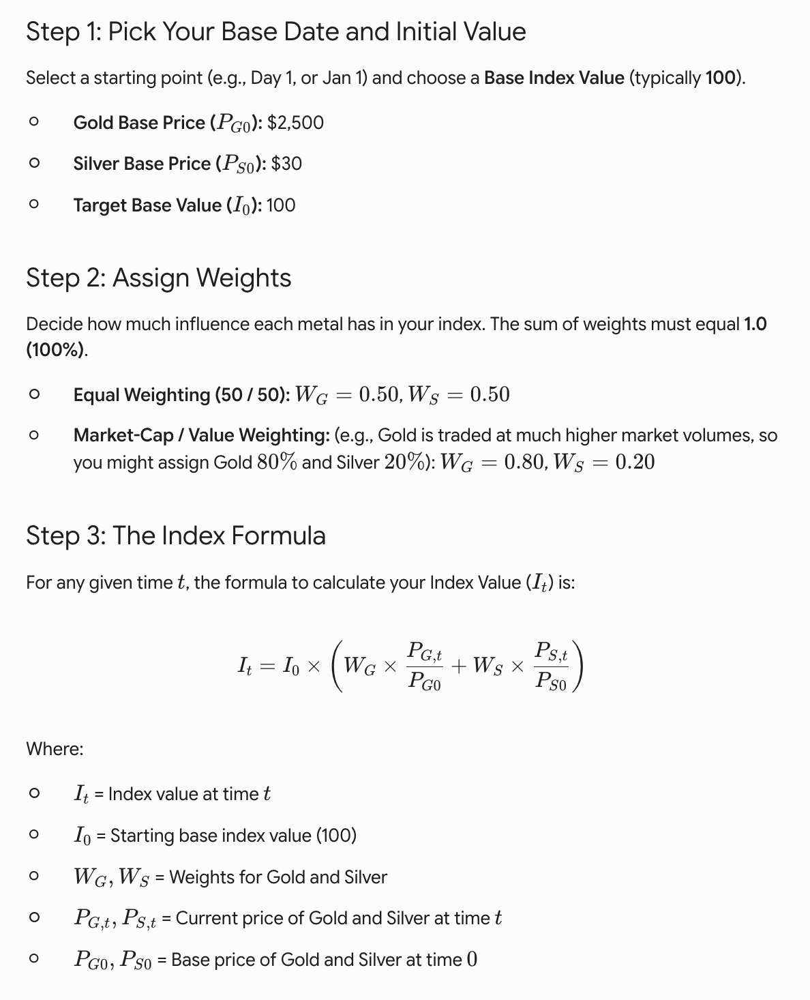

[Index Per Day Part 2](./screenshots/PartTwoIndex.png)

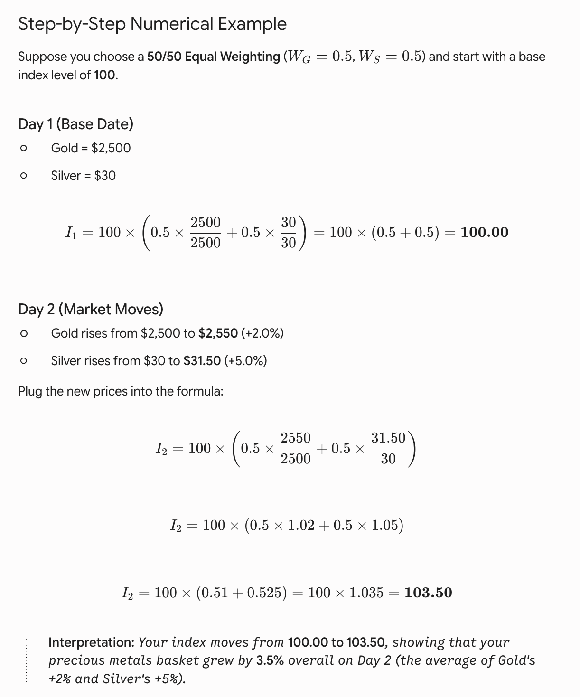

# Commodity Exchange Learning
More volume means more liquidity that means less risk

# SQL Learnings
Aggreates table cannot find information individually, you have to join up with another table

# Data Modelling
Link t0 What is STAR schema | Star vs Snowflake Schema | Fact vs Dimension Table
- https://www.youtube.com/watch?v=hQvCOBv_-LE

Data comes in highly denormalized (a lot of duplicate data because not relational). Everything is stored in a single row

[Denormalized table](./screenshots/denormalizedTable.png)

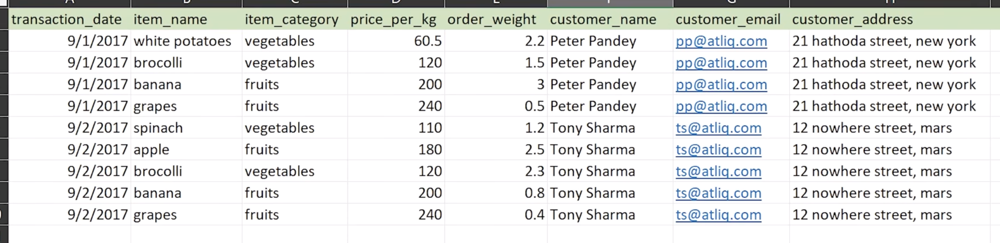

Normalization (1nf, 2nf, 3nf, 4nf). After going through this process, you get Dimension table, Dimension table would contain primary keys (Unique and Not null contraint)

The original table will now have foreign keys to the Dimension table and is now called Fact table.

[Fact & Dimension Tables](./screenshots/Fact&DimensionTables.png)

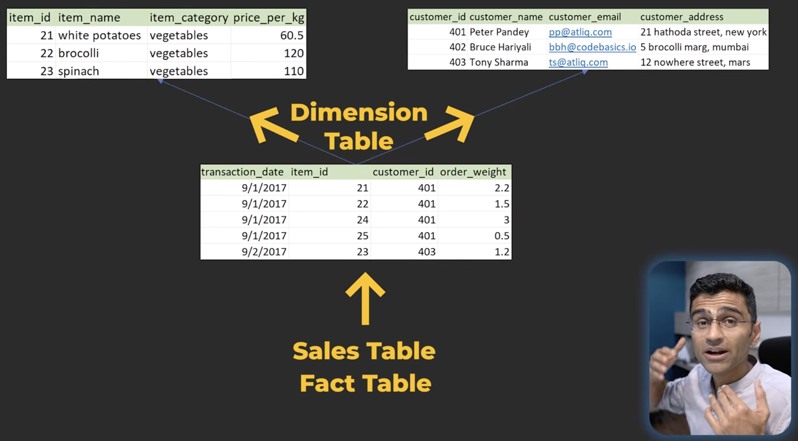

The shape of this relationship looks like a star schema

[Star Schema](./screenshots/StarSchema.png)

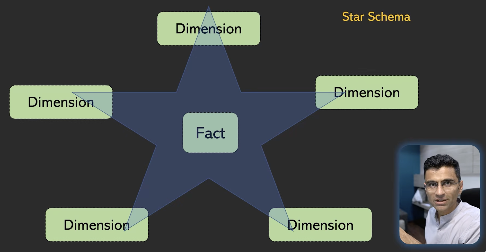

You might have a dimension tables that have more dimension tables relying on it, this is Snowflake Schema

[Snow Flake](./screenshots/snowflakeSchema.png)

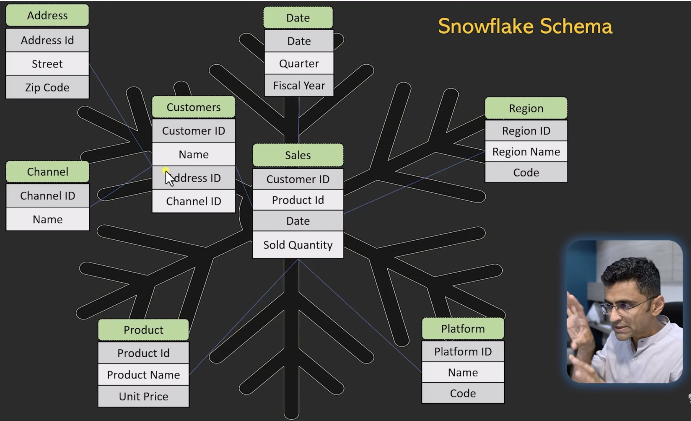


# Resources to learn DBT:
Building your First Model:
https://learn.getdbt.com/learn/course/dbt-fundamentals/models-60min/building-your-first-model?page=3

Default materialization is a view in dbt

The below will overide the default materialization, using table instead of view
{{ config(materialized='table') }}

dbt_project.yml will contain global configuration for materialization:
models:
  dbtproject:
    # Config indicated by + and applies to all files under models/example/
    example:
      +materialized: view

example for the above is reffering to models/example folder

Gemini Explanation on Staging:

In Medallion Architecture (Bronze $\rightarrow$ Silver $\rightarrow$ Gold), **Bronze** represents raw data, whereas dbt's **Staging** layer is the *first light transformation* step immediately on top of Bronze.

Here is how the concepts map directly to each other:

| Layer Concept | Medallion Architecture | dbt Layer | What Lives There |
| --- | --- | --- | --- |
| **Raw Ingestion** | **Bronze** | Raw Warehouse / `source()` | Exact copy of source data (JSON, messy schemas, uncast types, duplicates). |
| **Cleaned & Standardized** | **Silver** | **Staging (`stg_`)** & Intermediate | Renamed columns, cast types, light filtering, deduplication, and initial business logic. |
| **Business / Analytics** | **Gold** | **Marts (`fct_`, `dim_`)** | Aggregated data, dimensional models, and star schemas built for BI tools. |

---

### The Fine Print: Bronze vs. Staging

If you want to be precise:

* **Raw Data = Bronze:** The untouched landing table inside your Snowflake, BigQuery, or Databricks instance.
* **dbt Staging = Light Silver (or Bronze+):** The SQL view that reads from Bronze (`{{ source(...) }}`), renames `usr_id` to `user_id`, casts strings to timestamps, and standardizes types.

Because dbt doesn't handle the ingestion step itself (tools like Fivetran, Airbyte, or custom Python pipelines dump data into Bronze), **Staging is dbt’s entry point for Bronze data.**

So while your raw warehouse tables are technically the true Bronze layer, your dbt **Staging models act as the bridge between Bronze and Silver.**

*** DBT does not handle ingestion ***

Troubleshooting dbt run
https://learn.getdbt.com/learn/course/dbt-fundamentals/models-60min/building-your-first-model?page=6

Build customers upstreams objects (build the dependencies table / view first)
dbt run --select +customers

Build customers upstreams & downstreams objects (build the dependencies table / view first)
dbt run --select +customers+

Naming Conventions
https://learn.getdbt.com/learn/course/dbt-fundamentals/models-60min/building-your-first-model?page=8

Model Naming Conventions
- Source
Tables of raw data that were loaded into your data warehouse

- Staging
Make the data look like what you wished it looked like. This involves things like
renaming columns, casting data types, or currency conversions

- Intermediate
Joins and aggregations will occur. These should not depend directly on sources.
Instead they should depend on the staging models

- Fact
Real-world processes that have occured or are occuring. Usually an immutable event
stream: sessions, transactions, orders, stories, votes

- Dimensions
Each row is a person, place, or thing; Mutable, through slowly changing: customers,
products, candidates, buildings, employees

Materialization Strategies
https://learn.getdbt.com/learn/course/dbt-fundamentals/models-60min/building-your-first-model?page=10

Staging models best practices is to use view, these are connected to sources, and constantly new records in sources,
does not make sense to store staging record in a table, view will allow us to get the most up to date source records.

Marts models best practices is to use table, these are the data getting queried by PowerBi, Excel. If this was a view
everytime someone a query from Power Bi tool, this is going to execute the view which is inneficient to run a lot of transformations.
if marts models materialize as table, the records are already transformed and no need to spend time to do transformation. 

The + for +materialized is to indicate it's a property and not a folder.

References Sources in Staging Models
https://learn.getdbt.com/learn/course/dbt-fundamentals/sources-60min/understanding-sources?page=5

Sources and Staging models should have a 1 to 1 relationship, so each source should only feed into one staging model

source functions is powerful because the schema name or table name changes in the database, you only have to update in one place
models/staging/_src_jaffle_shop.yml

Freshness (Advance topic)
https://learn.getdbt.com/learn/course/dbt-fundamentals/sources-60min/understanding-sources?page=6

Package (Utilies to save time, Advance topic)
https://learn.getdbt.com/learn/course/dbt-fundamentals/sources-60min/understanding-sources?page=7

Generate Models from staging yml (Utilies to save time)
https://learn.getdbt.com/learn/course/dbt-fundamentals/sources-60min/understanding-sources?page=8

After clicking generate, click save to save the generated staging model

Cleaning up Staging Models (Best practises around transformation)
https://learn.getdbt.com/learn/course/dbt-fundamentals/sources-60min/understanding-sources?page=9

Best practises on Staging models CTE naming & functionality
- renaming columns: for clarity and consistency
- filtering rows: removing irrelevant or invalid records
- type casting: converting data types for consistency
- basic computations: i.e. converting cents to dollars
- basic date transformations

Further reading:
https://docs.getdbt.com/best-practices/how-we-style/1-how-we-style-our-dbt-models?version=2.0

Migrating legacy code:
https://learn.getdbt.com/learn/course/refactoring-sql-for-modularity-vs-code/learn-the-refactoring-process-120min/the-refactoring-process?page=2

You don't need to create DDL statement like CREATE TABLE, DBT will handle that for you

(Important) Intro to Centralizing logic
https://learn.getdbt.com/learn/course/refactoring-sql-for-modularity-vs-code/learn-the-refactoring-process-120min/centralizing-logic?page=1

Staging - Transformation Layer
Intermediate - [Optional] Transormation / Joining Layer
Marts - Consumption Layer
FACT - Quantitative metrics and events (Inside Marts models)
DIM - Descriptive context (Inside Marts models)

Customers Staging CTE
https://learn.getdbt.com/learn/course/refactoring-sql-for-modularity-vs-code/learn-the-refactoring-process-120min/centralizing-logic?page=2

Marts models are identified by their join logic, we are not transforming a single source anymore,
but now we're doing transformations on multiple models to create some analytical insights.

Staging models are creating building blocks for analysis. Like casting data type, doing renaming,
combining multiple fields into new one, flatening and extracting fields from like a json column. 
That cleaned data is then gonna be used by developers to build any number of downstream models
without having to perform the same types of cleanps on that data in multiple places.

Gemini Answer:
| Architectural Feature | Staging Layer (`stg_`) | Intermediate Layer (`int_`) | Marts Layer (`fct_`, `dim_`) |
| :--- | :--- | :--- | :--- |
| **Primary Responsibility** | Clean, rename, cast types, and standardize raw source data. | Isolate complex transformations, re-grain data, and build reusable logic. | Provide business-ready, modeled entities for analytics and BI dashboards. |
| **Row Count / Grain Shift** | **1-to-1** with source table (No row collapsing or changing grain). | **Variable** (Re-grained, aggregated, or joined across domains). | **Entity-based** (1 row per order, 1 row per customer, 1 row per event). |
| **Aggregations (`GROUP BY`)** | ❌ **Forbidden** | ✅ **Primary use case** (collapsing details before joins) | ✅ **Allowed** (calculating final measures and metrics) |
| **Joins Across Tables** | ❌ **Forbidden** (only source-to-staging mapping) | ✅ **Allowed** (combining related staging or intermediate tables) | ✅ **Allowed** (joining clean intermediate components) |
| **Window Functions** | ❌ **Forbidden** (keep staging lightweight) | ✅ **Primary use case** (sessionizing, deduplication, row numbers) | ⚠️ **Use sparingly** (push complex windowing back to intermediate) |
| **Business Logic & Rules** | ❌ **Forbidden** (zero business definitions) | ⚠️ **Partial** (pre-calculating foundational measures) | ✅ **Full** (applying active definitions, metrics, status flags) |
| **Folder Path** | `models/staging/<source_system>/` | `models/intermediate/<domain>/` | `models/marts/<business_unit>/` |
| **File Naming Convention** | `stg_<source>__<entity>.sql` | `int_<entity>_<verb_or_action>.sql` | `fct_<entity>.sql` or `dim_<entity>.sql` |
| **Model Dependency (`ref`)** | Points ONLY to `{{ source() }}` macros. | Points to `{{ ref('stg_...') }}` or other `int_` models. | Points to `{{ ref('int_...') }}` or directly to `{{ ref('stg_...') }}`. |
| **Recommended Materialization** | `view` | `ephemeral` or `view` | `table` or `incremental` |
| **Exposed to End Users / BI?** | ❌ **No** (internal developer abstraction) | ❌ **No** (hidden from production reporting schemas) | ✅ **Yes** (queried by Metabase, Tableau, Looker, SQL tools) |
| **Necessity in Projects** | 🔴 **Mandatory** | 🟡 **Optional** (added as DAG complexity grows) | 🔴 **Mandatory** |


What are analyses?
https://learn.getdbt.com/learn/course/analyses-and-seeds-vs-code/analyses-and-seeds-30min/understanding-analyses?page=2

What are seeds?
https://learn.getdbt.com/learn/course/analyses-and-seeds-vs-code/analyses-and-seeds-30min/understanding-analyses?page=3

# Data Engineering With DBT
## Chapter 1
When working with dbt, you will not need to write create table or create view
statements, as dbt will create them for us. It is nevertheless good to get familiar with these
basic SQL commands as these are the commands executed in the database and you will see
them if you look in the logs.

To create the TEST database and the SOME_DATA schema in it, we can use the following commands:
CREATE DATABASE TEST;
CREATE SCHEMA TEST.SOME_DATA;

### Users and roles
The following is an example of a simple setup with one role and a couple of users:
CREATE ROLE DBT_SAMPLE_ROLE;
CREATE USER MY_NAME; -- Personal user
CREATE USER SAMPLE_SERVICE; -- Service user
GRANT ROLE DBT_SAMPLE_ROLE TO USER MY_NAME;
GRANT ROLE DBT_SAMPLE_ROLE TO USER SAMPLE_SERVICE;

A more complex setup could have one role to read and one to write for each source system (represented
by a schema with the data from the system), for the data warehouse (one or more schemata where the
data is processed), and for each data mart (one schema for each data mart).

You could then control in much more detail who can read and write what, at the cost of more effort.

The below syntax is available for postgres:
SELECT * FROM ( VALUES
('IT', 'ITA', 'Italy')
,('US', 'USA', 'United States of America')
,('SF', 'FIN', 'Finland (Suomi)')
);

### Query clause order of evaluation
1) FROM and its JOIN subclause, which are used to identify the source data for the query.
2) The WHERE clause, which is used to filter out the source data that we do not want.
This is probably the most important clause for performance, because the less data a query
works on, the quicker it is. Use WHERE whenever possible to just bring in the data you need.
3) The GROUP BY clause, which groups the source data left after applying the WHERE clause and
calculates the aggregate functions on the grouped data.
4) The HAVING clause, which filters on the results of GROUP BY.
5) Partitioning of the windows and calculation of the window functions.
6) The QUALIFY clause, which filters on the results of the window functions.
7) The DISTINCT keyword, if applied to the SELECT clause, which removes duplicated rows.
8) The ORDER BY clause, which puts the resulting rows in the desired order.
9) The LIMIT clause, which caps the rows returned by the query to the desired amount.

## Chapter 2
### Comparing dbt Core and dbt Cloud workflows
There are two dbt versions that you can decide to use:
- dbt Core: This is open source software created by dbt Labs, developed in Python, that you can
freely download and use locally from the command line on many operating systems, such as
Windows, Mac, and Linux. It provides all the core functionalities of dbt and can also be used
for commercial projects.

- dbt Cloud: This is a commercial software created by dbt Labs that offers a Software-as-a-Service
(SaaS) experience that includes all the functionalities from dbt Core wrapped in a web interface
that makes it easier to use the dbt Core functionalities, adding many features that are useful
when running a real-life data project.

### dbt Core workflows (Long read)

### Exploring the dbt default model
#### Analysis of my_first_dbt_model
Probably the most interesting row is line 1, as it is not SQL code, but an inline configuration that
directs dbt to materialize the result of this query as a table. If you preview the model, you will see the
result of its SQL, in the dbt Cloud IDE, but you will generate nothing on your DB. To affect your DB,
you need to run your model using the dbt run or dbt build command.

Important note
Doing a preview of a model will run the query in the model as it is, while when running a
model, using the dbt run command will wrap the SELECT query with the correct DDL to
materialize the model in the DB in the desired way, such as a table or a view.

#### Analysis of my_first_dbt_model
If you try to preview this model before you have used the dbt run command, you will get an error,
as the first model that you reference does not exist on your DB. Most probably, the schema with your
selected schema name will not exist either.

We will use the dbt run command in the next section, so for the moment, we can just note that
this model just selects everything from your first model that is referenced simply by its name using
the dbt ref function.

The curly brackets symbols, { and }, are used to start and end the blocks of Jinja code in our models.
We will look at Jinja in more detail in the second part of the book. For the moment, note that double
curly brackets symbols, {{, are used to print out values from Jinja expressions.

We then expect that the {{ ref('my_first_dbt_model') SQL name to reference the table or view containing the first model.

#### Analysis of schema.yml

### Using ref and source to connect models
The ref and source functions are the keystones of how dbt works; by using them, we provide dbt
with the information needed to build the graph of dependencies of the whole project, and dbt is then
able to generate the SQL code dynamically, making it simple to write a model once and deploy it to
multiple environments.

### Further Reading
https://docs.getdbt.com/docs/introduction?version=2.0&name=v2
https://docs.getdbt.com/reference/dbt_project.yml?version=2.0&name=v2

# Postgres DBA
Link:
https://training.enterprisedb.com/learn/courses/147/foundations-of-postgresqlr-v13/lessons/202:71/module6creatingandmanagingdatabases

Command to enter postgres:
- docker exec -it postgres-container psql --dbname=postgres --username=postgres --password  

## Object Hierarchy
```
postgres=# \l
                                                    List of databases
   Name    |  Owner   | Encoding | Locale Provider |  Collate   |   Ctype    | Locale | ICU Rules |   Access privileges   
-----------+----------+----------+-----------------+------------+------------+--------+-----------+-----------------------
 postgres  | postgres | UTF8     | libc            | en_US.utf8 | en_US.utf8 |        |           | 
 template0 | postgres | UTF8     | libc            | en_US.utf8 | en_US.utf8 |        |           | =c/postgres          +
           |          |          |                 |            |            |        |           | postgres=CTc/postgres
 template1 | postgres | UTF8     | libc            | en_US.utf8 | en_US.utf8 |        |           | =c/postgres          +
           |          |          |                 |            |            |        |           | postgres=CTc/postgres
```
list of available databases

```
postgres=# \du
                             List of roles
 Role name |                         Attributes                         
-----------+------------------------------------------------------------
 postgres  | Superuser, Create role, Create DB, Replication, Bypass RLS
```

shows the list of roles available in database

```
postgres=# \db
       List of tablespaces
    Name    |  Owner   | Location 
------------+----------+----------
 pg_default | postgres | 
 pg_global  | postgres | 
(2 rows)
```

Not entirely sure the purpose of tablespace

```
postgres=# \dn
       List of schemas
  Name   |       Owner       
---------+-------------------
 public  | pg_database_owner
 staging | postgres
(2 rows)
```

shows that public is the default schema for postgres database, this is where all objects will go


## Creating Databases
Whanever we create a database, by default every single user has permission to connect to database, by default 
the role public which is assigned by default to everybody has a connect privillage on the brand new database.
For security purpose revoke connect on database on role public, this will revoke all normal users.

Owner and Super user can still connect even if revoke from public role

[My database & schema object](./screenshots/myDatabase.png)

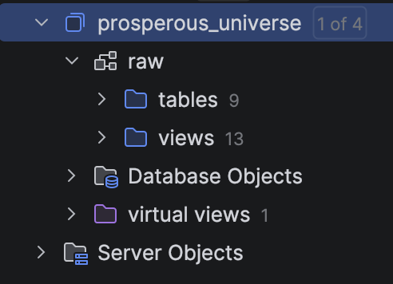

[Object Hierarchy](./screenshots/objectHierarchy.png)

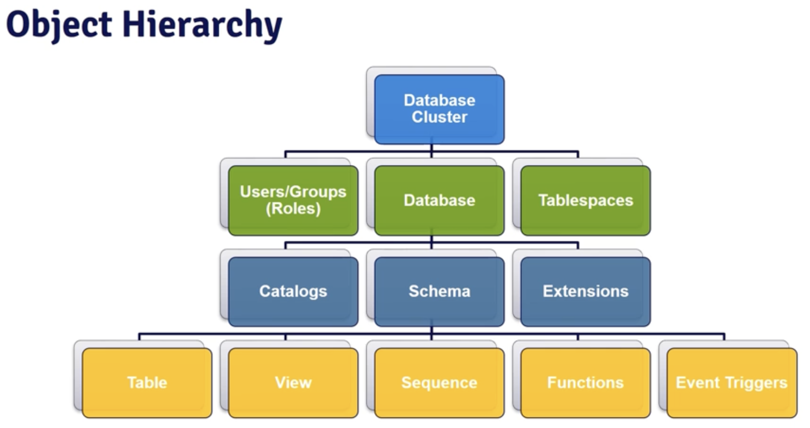

- Prosperous_universe is Database object
- raw is Schmea object

[Slide 1](./screenshots/createDatabase1.png)

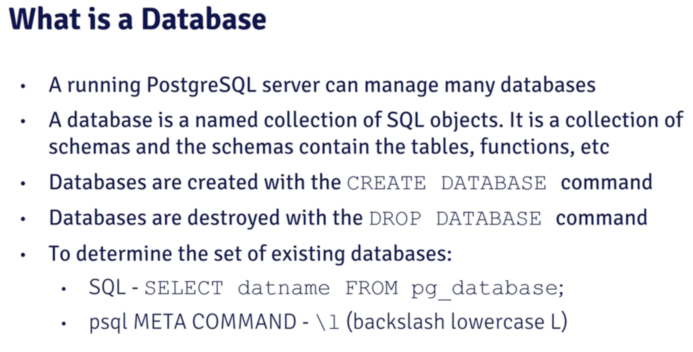

[Slide 2](./screenshots/createDatabase2.png)

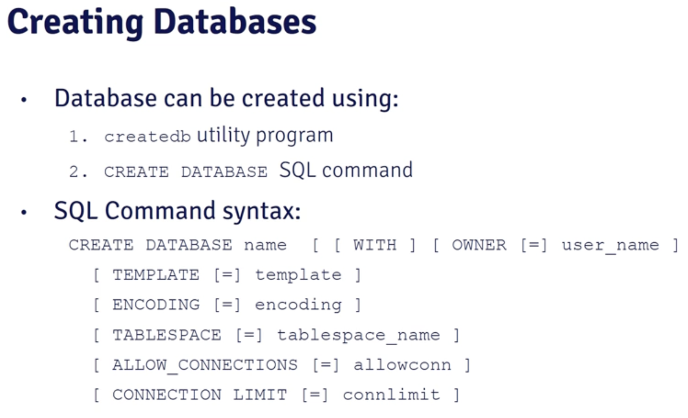

[Slide 3](./screenshots/createDatabase3.png)

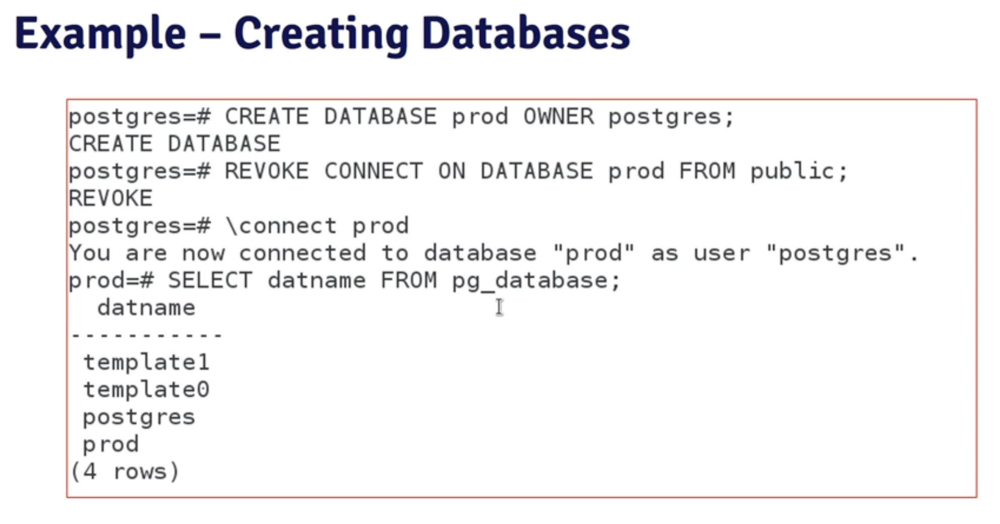

[Slide 4](./screenshots/createDatabase4.png)

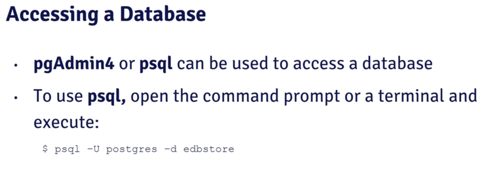

## Users and Roles
postgres is a predefined superuser in the default database cluster


## Access Control

## Creating Schemas
[raw schema objects](./screenshots/mySchema.png)

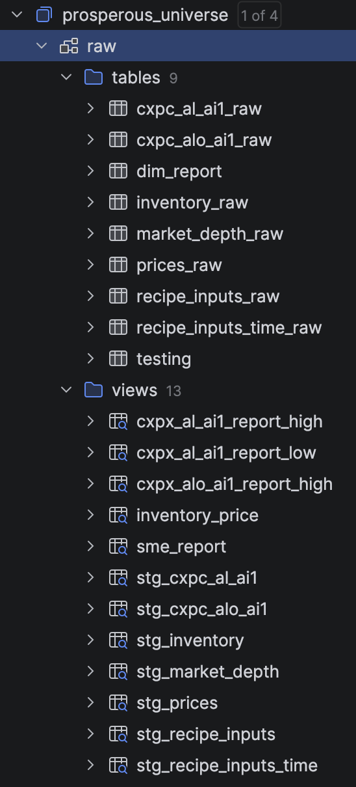

[Slide 1](./screenshots/creatingSchema1.png)

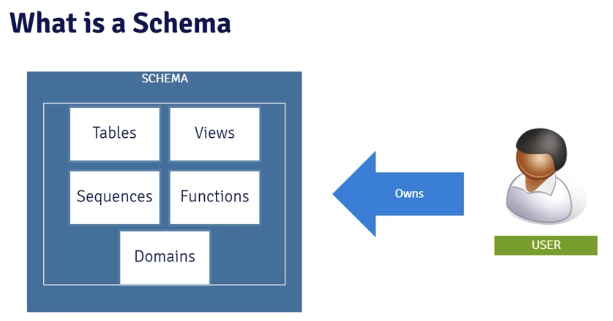

My raw schema in Prosperous Universe Database contains many tables and views. 

[Slide 2](./screenshots/creatingSchema2.png)

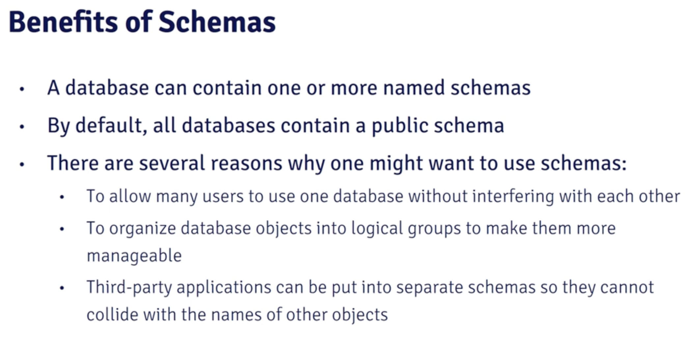

[Slide 3](./screenshots/creatingSchema3.png)

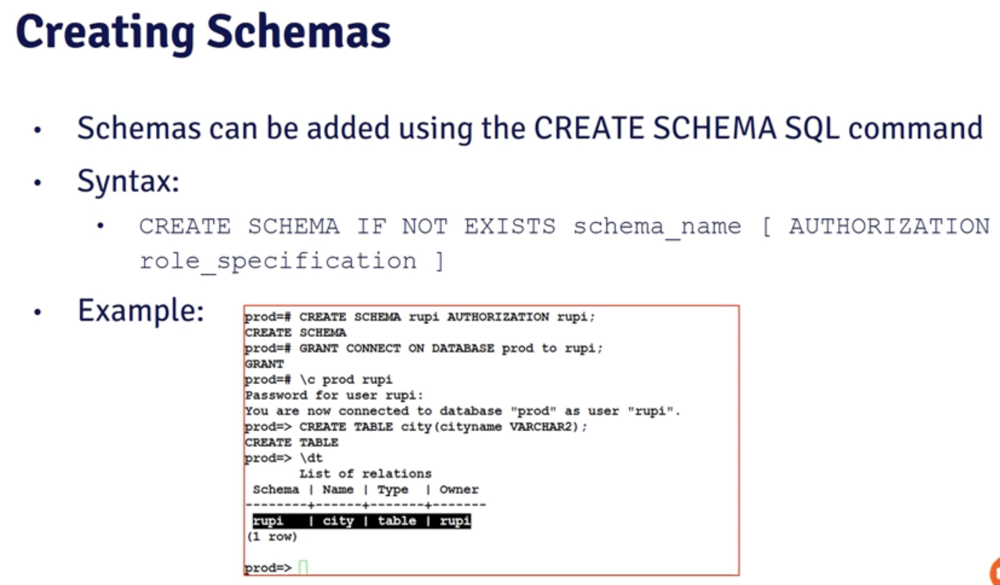

[Slide 4](./screenshots/creatingSchema4.png)

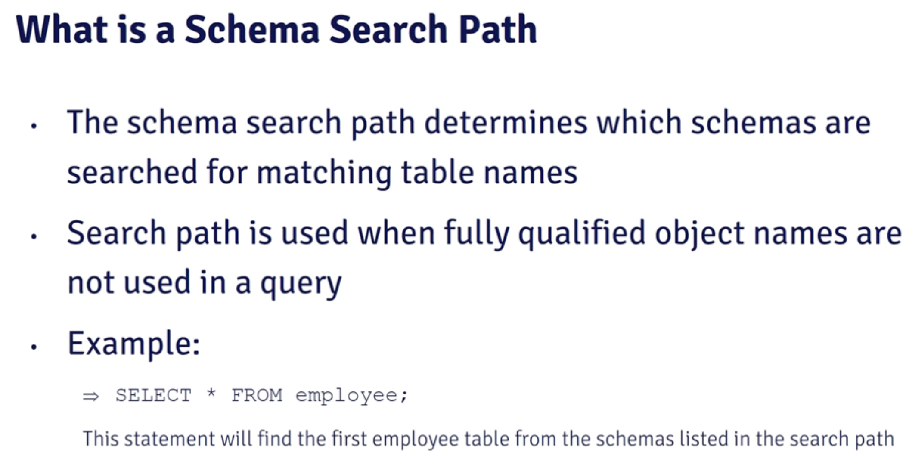

[Slide 5](./screenshots/creatingSchema5.png)

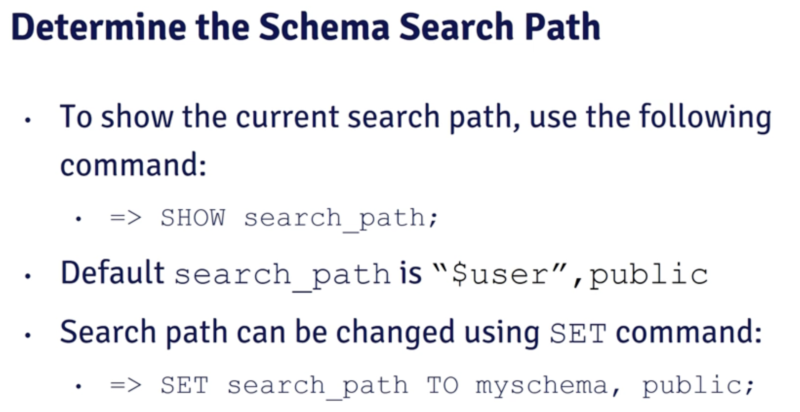

[Slide 6](./screenshots/creatingSchema6.png)

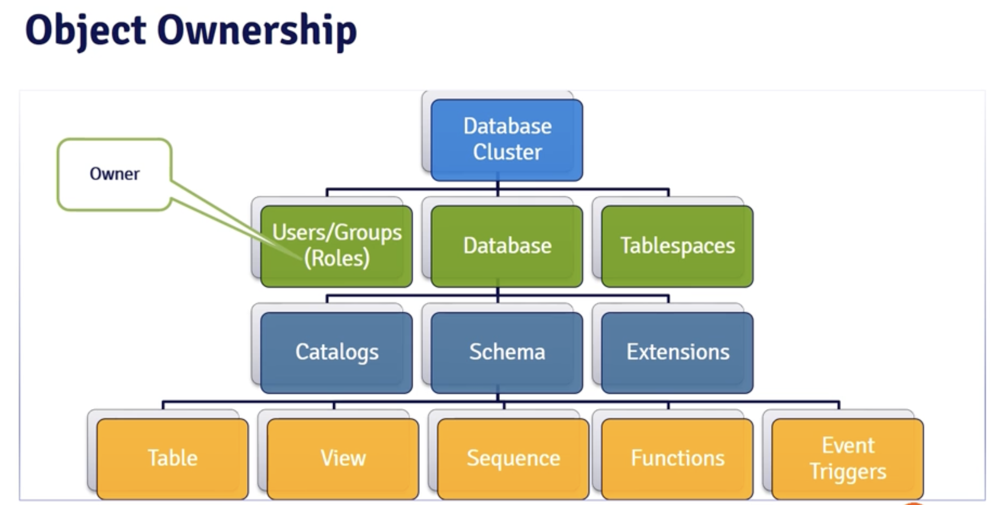

## Schema Search Path

# Extra Readme
https://unix.stackexchange.com/questions/15348/writing-basic-systemd-service-files