# Data-Science-Projects

# Project Highlights

[First Profitable Run](./screenshots/FirstProfitableRun.png)

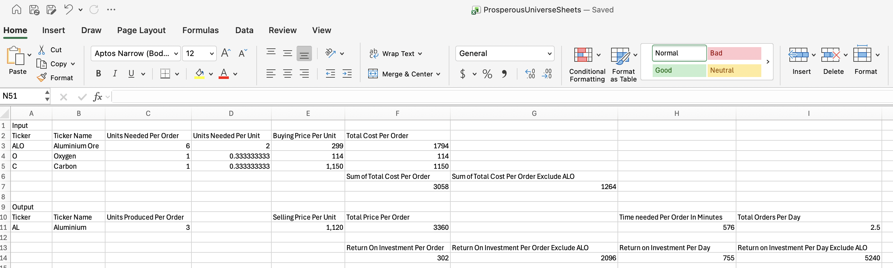

[Time Series Analysis](./screenshots/timeSeriesAnalysis.png)

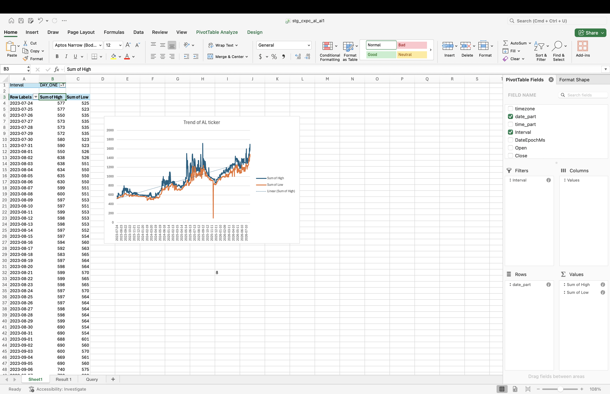

[Identify Outlier through Standard Deviation](./screenshots/IdentifyOutlierStandardDeviation.png)

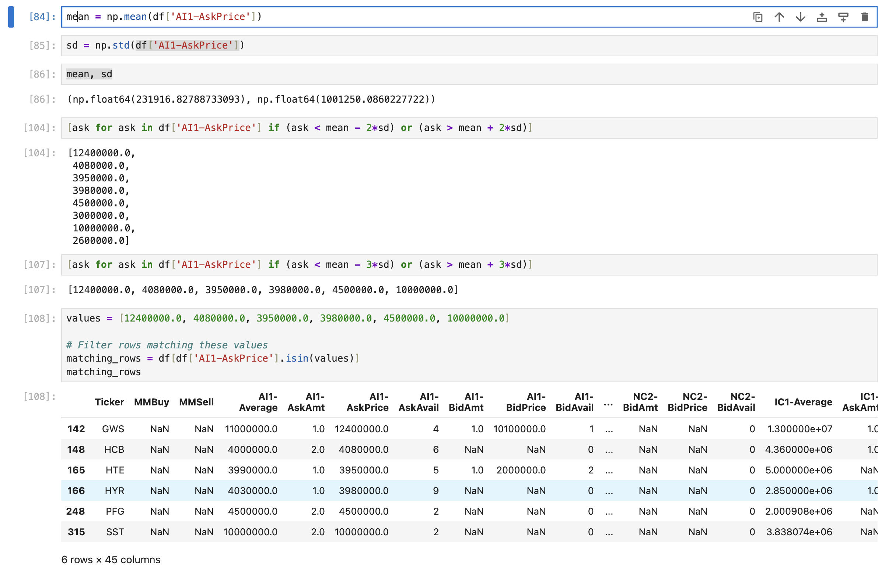

[Dagster & DBT Lineage](./screenshots/dagster&dbtLineage.png)

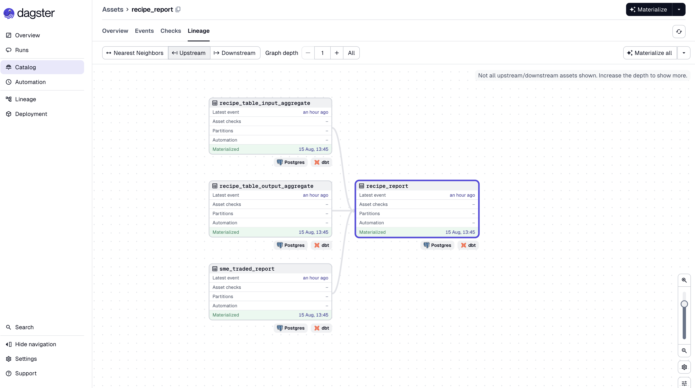

[Dagster & DBT Global Lineage](./screenshots/dagster&dbtGlobalLineage.png)

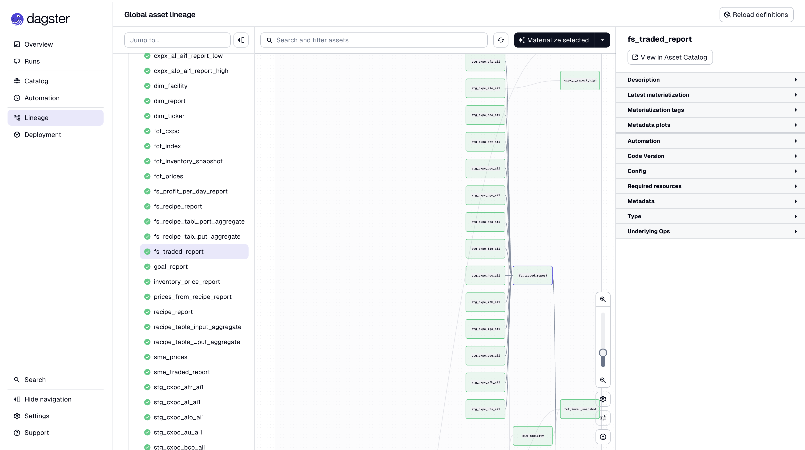

[Created Fact and Dimension](./screenshots/myprojecyFact&Dimension.png)

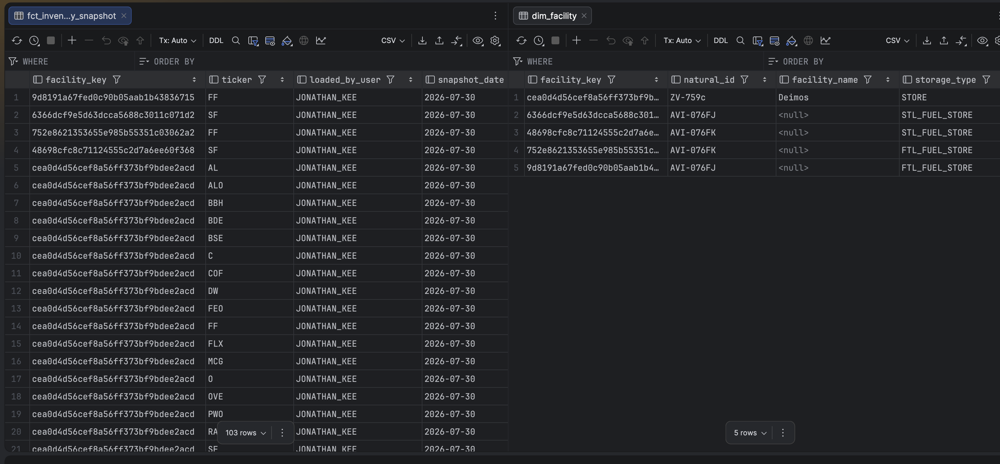

[Medallion Archictecture](./screenshots/medallionArchitecture.png)

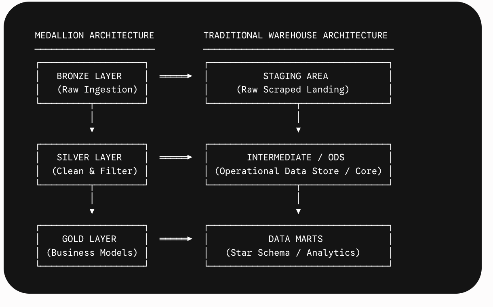

# Reports
## SQL Reports
[FS Recipe Report](./screenshots/fsReport.png)

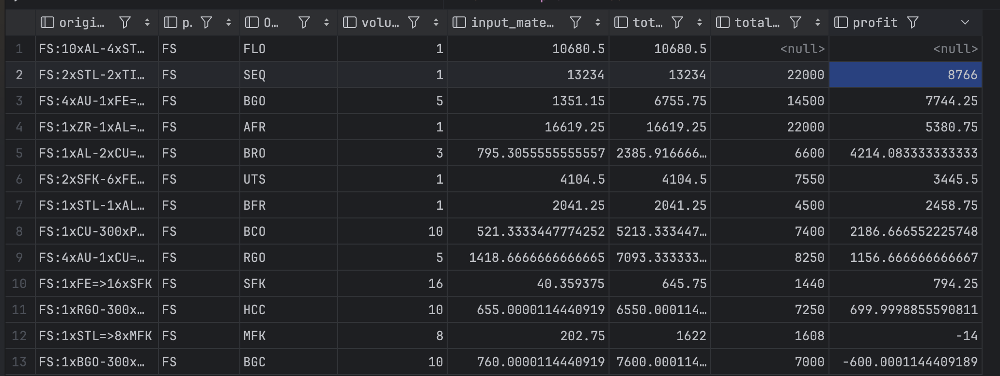

Shows which Metalist Studio's recipe shows the highest ROI

[Recipe Report](./screenshots/recipe_report.png)

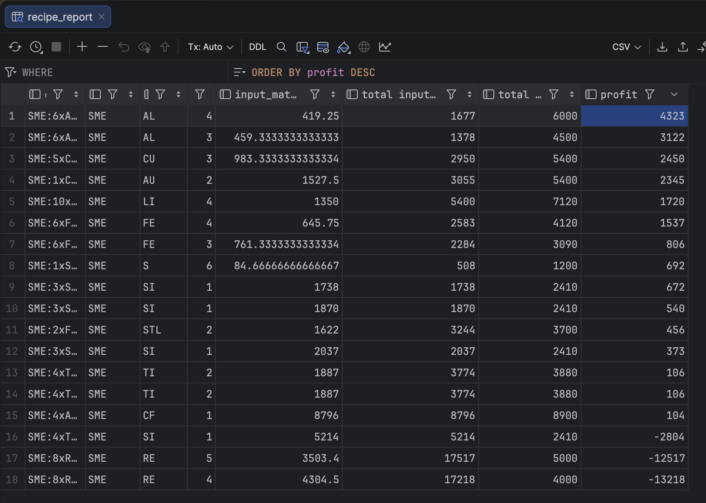

Shows which Smeltor's recipe shows the highest ROI

[cxpx_al_ai_report_high](./screenshots/cxpx_al_a1_report_high.png)

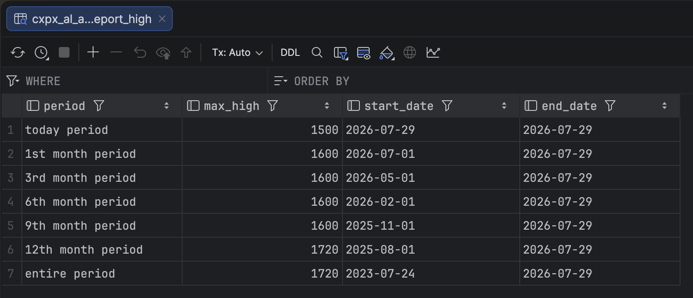

Shows ticker AL (Aluminium) todays's high with previous 1st, 3rd, 6th, 9th, 12th, entire period

[cxpx_alo_ai_report_high](./screenshots/cxpx_alo_a1_report_high.png)

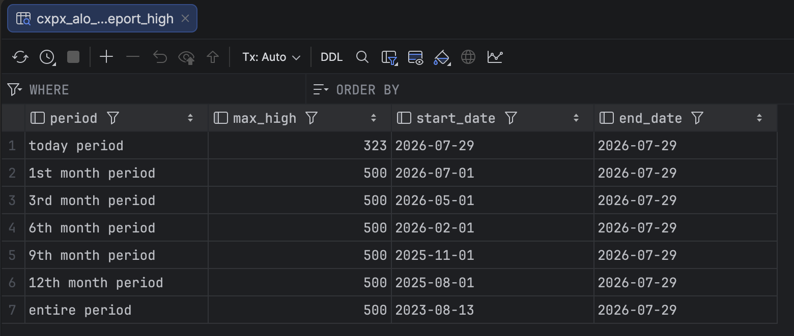

Shows ticker ALO (Aluminium Ore) todays's high with previous 1st, 3rd, 6th, 9th, 12th, entire period

[inventory Price](./screenshots/inventoryPrice.png)

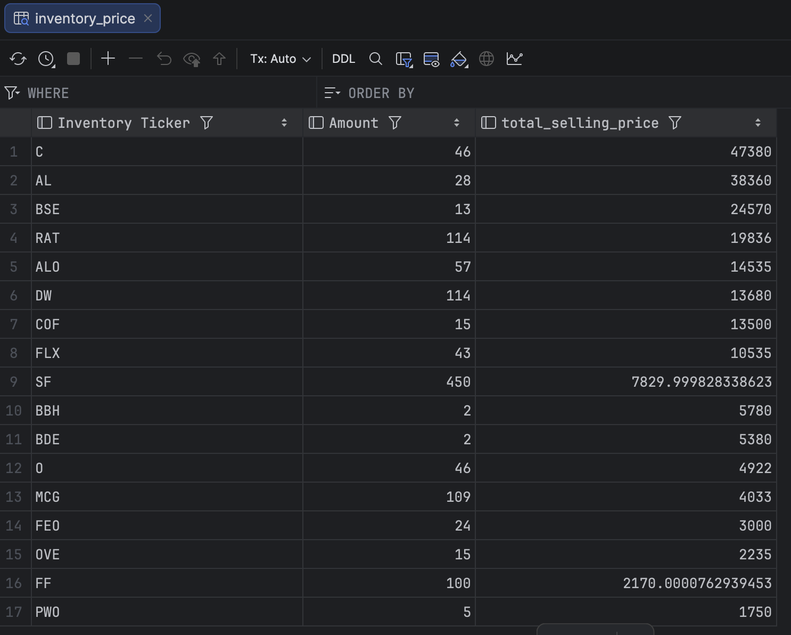

Shows the selling price of your base inventory

[goal report](./screenshots/goalReport.png)

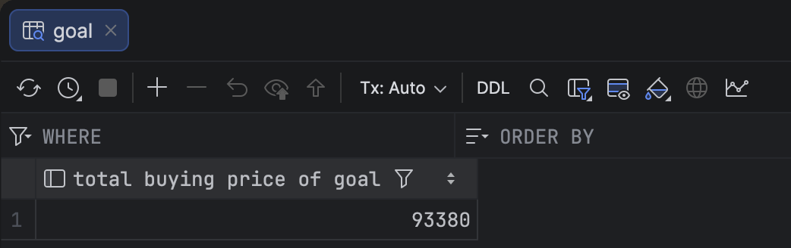

Shows the total buying price of 2 HB2 and 1 FS

## Excel Reports
How to bucket data guide:
https://edferrero.com/index.php/en/blog

Resource to learn more:
https://link.springer.com/book/10.1007/978-3-031-70584-7

*** Important fact, you need to consult GBT if formula will apply on reference table that is filtered ***
^
The best way is to filter the data and just put the data into a new sheet, then formula on that new sheet.

Excel Sheet: stg_cxpc_al_ai1

[First Iteration of Bucket open price](./screenshots/bucketPrice.png)

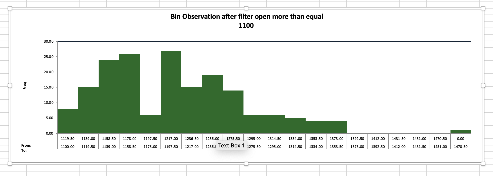

[Second Iteration of Bucket open price](./screenshots/bucketPrice2.png)

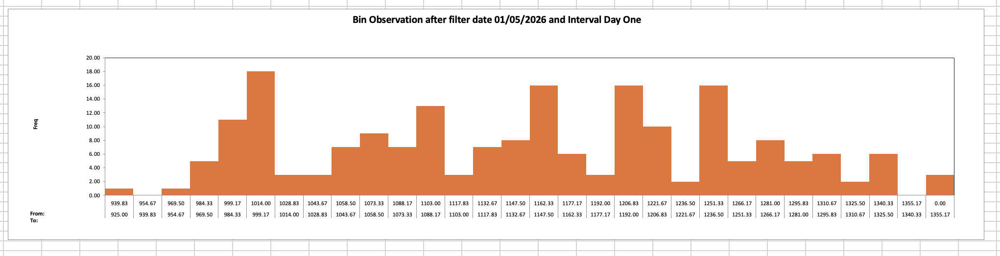

I decided to bucket (20 bucket) the chart data for AL.A1 , so because Seller Price now is 1470, and it's position is tail end of the buckets, does this mean the Seller Price will go higher / trending up? 

Question: How do know which date do I want to filter the data? So that the chart make sense, it will not be entire data because 500 to 1000 range is too low, I think
I have to find the new floor.
I guess you can create a ranking for the lowest open prices, and their dates

# Vscode extensions to download
sqlfluff to linter sql properly for best practises

# DBT Website crendentials
E4J8NLKAYRZ67GK5XWMDDKBR

# DBT Setup
Link (lastest dbt core has issue, downgrade to 1.8.0 for stable):
https://www.youtube.com/watch?v=ALuYdar1vCc&t=986s

Create schema for current docker postgres called STAGING in datagrip
- create schema staging;

Create virtual environments:
- python3 -m venv dbt-demo

Virtual environment to keep dependencies local to repo
- source dbt-demo/bin/activate

## Incase Installation went wrong
### 1. Deactivate the current environment
- deactivate

### 2. Delete the dbt-demo folder
rm -rf dbt-demo

### 3. Create a fresh virtual environment named dbt-demo
python3 -m venv dbt-demo

### 4. Activate it
source dbt-demo/bin/activate

Check if virtual environment is fresh
- pip freeze

Install dependencies
- pip install -r requirements.txt

Check dependencies
- pip freeze

Initialize dbt project
- dbt init

To check database connection is correct:
- /Users/jonathankee/.dbt/profiles.yml

Change dictory to dbtproject to run dbt commands:
- cd dbtproject

Check if connection is correct:
- dbt debug

Make dbt create table or view inside postgres:
- dbt run

Make dbt run specific model:
- dbt run --select my_first_dbt_model.sql

Make dbt download packages
- dbt deps

Make dbt test dimension and fact tables
dbt test --select dim_ticker fct_prices
dbt test --select dim_facility fct_inventory_snapshot

# DBT column lineage
Change dictory to dbtproject to run dbt commands:
- cd dbtproject

Run dbt to generate the required artifacts:
- dbt compile
- dbt docs generate

Generate lineage report:
- colibri generate

View results: Open dist/index.html in your browser

# Dagster setup
Install UV (macOS and Linux)
- curl -LsSf https://astral.sh/uv/install.sh | sh

Install dagster cli
- uvx create-dagster 

Create project in current directory:
- uvx create-dagster project .

Activate project's virtual environment:
- source .venv/bin/activatedg

Deactivate environment:
- deactivate

Check if dagster code is correct:
- dg check defs

Materializing assets using the Dagster UI:
- dg dev

Reload dependencies:
- uv sync

See dependency graph:
- uv tree

# Use Python verions that works for project
Tell uv to target Python 3.12 for this project:
- uv python pin 3.12

Remove the current Python 3.14 environment and build a new one using Python 3.12::
- rm -rf .venv
- uv venv --python 3.12
- uv sync

Confirm your environment is now on Python 3.12:
- uv run python --version

Output should show: Python 3.12.x

# Ingestion Pipeline commands
cxpc_AL_AI1.json is Download from https://doc.fnar.net/#/exchange/get_exchange_cxpc__ExchangeTicker_

Rebuild typescript files:
- tsc --build --clean 
- tsc --build  

Exchange ticker json ingestion:
- tsc && node ./build/ingestion/json/cxpc.js "https://rest.fnar.net/exchange/cxpc/AL.AI1"
- tsc && node ./build/ingestion/json/cxpc.js "https://rest.fnar.net/exchange/cxpc/ALO.AI1"

Building costs json ingestion:
- tsc && node ./build/ingestion/json/building.js "https://rest.fnar.net/building/HB2"
- tsc && node ./build/ingestion/json/building.js "https://rest.fnar.net/building/FS"

Prices csv ingestion:
- python ingestion/csv/ingest.py "https://rest.fnar.net/csv/prices" 
    
inventory csv ingestion:
- python ingestion/csv/ingest.py "https://rest.fnar.net/csv/inventory?apikey=0f11ac24-ef14-428f-8213-4438576837f4&username=jonathan_kee"

Docker command to feed sql file into docker postgres
- cd injestion/sql
- docker exec -i -e PGPASSWORD=abc123 postgres-container psql --dbname=prosperous_universe --username=postgres < ./cxpc_AL_AI1_30072026.sql
- docker exec -i -e PGPASSWORD=abc123 postgres-container psql --dbname=prosperous_universe --username=postgres < ./cxpc_ALO_AI1_30072026.sql
^
This will truncate the existing table and insert the new data, the new data already contain historical data, so there's nothing to worry.

## Download CSV from api /csv/prices 
- cd csv
- curl -s -X GET "https://api.fnar.net/csv/prices?include_header=true" -H "accept: text/csv" -o prices.csv
- curl -X 'GET' 'https://api.fnar.net/csv/recipeinputs?include_header=true' -H 'accept: text/csv' -o recipeInputs.csv
- copy over csv file to docker container

## Test Postgres docker connection & location
- docker exec -it postgres-container sh
- docker cp \
    ./csv/prices.csv \
    postgres-container:/tmp/prices.csv
- docker cp \
    ./csv/recipeInputs.csv \
    postgres-container:/tmp/recipeInputs.csv

## Docker Postgres Import CSV File Into PostgreSQL Table
- CREATE TABLE market_depth_raw (
    "Ticker"        VARCHAR(10) PRIMARY KEY,
    "MMBuy"         NUMERIC(15, 2),
    "MMSell"        NUMERIC(15, 2),
    
    "AI1-Average"   NUMERIC(15, 2),
    "AI1-Previous"  NUMERIC(15, 2),
    "AI1-AskAmt"    NUMERIC(15, 4),
    "AI1-AskPrice"  NUMERIC(15, 2),
    "AI1-AskAvail"  INTEGER,
    "AI1-BidAmt"    NUMERIC(15, 4),
    "AI1-BidPrice"  NUMERIC(15, 2),
    "AI1-BidAvail"  INTEGER,

    "CI1-Average"   NUMERIC(15, 2),
    "CI1-Previous"  NUMERIC(15, 2),
    "CI1-AskAmt"    NUMERIC(15, 4),
    "CI1-AskPrice"  NUMERIC(15, 2),
    "CI1-AskAvail"  INTEGER,
    "CI1-BidAmt"    NUMERIC(15, 4),
    "CI1-BidPrice"  NUMERIC(15, 2),
    "CI1-BidAvail"  INTEGER,

    "CI2-Average"   NUMERIC(15, 2),
    "CI2-Previous"  NUMERIC(15, 2),
    "CI2-AskAmt"    NUMERIC(15, 4),
    "CI2-AskPrice"  NUMERIC(15, 2),
    "CI2-AskAvail"  INTEGER,
    "CI2-BidAmt"    NUMERIC(15, 4),
    "CI2-BidPrice"  NUMERIC(15, 2),
    "CI2-BidAvail"  INTEGER,

    "NC1-Average"   NUMERIC(15, 2),
    "NC1-Previous"  NUMERIC(15, 2),
    "NC1-AskAmt"    NUMERIC(15, 4),
    "NC1-AskPrice"  NUMERIC(15, 2),
    "NC1-AskAvail"  INTEGER,
    "NC1-BidAmt"    NUMERIC(15, 4),
    "NC1-BidPrice"  NUMERIC(15, 2),
    "NC1-BidAvail"  INTEGER,

    "NC2-Average"   NUMERIC(15, 2),
    "NC21-Previous" NUMERIC(15, 2),
    "NC2-AskAmt"    NUMERIC(15, 4),
    "NC2-AskPrice"  NUMERIC(15, 2),
    "NC2-AskAvail"  INTEGER,
    "NC2-BidAmt"    NUMERIC(15, 4),
    "NC2-BidPrice"  NUMERIC(15, 2),
    "NC2-BidAvail"  INTEGER,

    "IC1-Average"   NUMERIC(15, 2),
    "IC1-Previous"  NUMERIC(15, 2),
    "IC1-AskAmt"    NUMERIC(15, 4),
    "IC1-AskPrice"  NUMERIC(15, 2),
    "IC1-AskAvail"  INTEGER,
    "IC1-BidAmt"    NUMERIC(15, 4),
    "IC1-BidPrice"  NUMERIC(15, 2),
    "IC1-BidAvail"  INTEGER
);

- COPY market_depth_raw
FROM '/tmp/prices.csv'
WITH (FORMAT csv, HEADER true, NULL '');

- CREATE TABLE recipe_inputs_raw (
    "Key"       VARCHAR(100) NOT NULL,
    "Material"  VARCHAR(20),
    "Amount"    INTEGER NOT NULL
);

- COPY recipe_inputs_raw
FROM '/tmp/recipeInputs.csv'
WITH (FORMAT csv, HEADER true, NULL '');