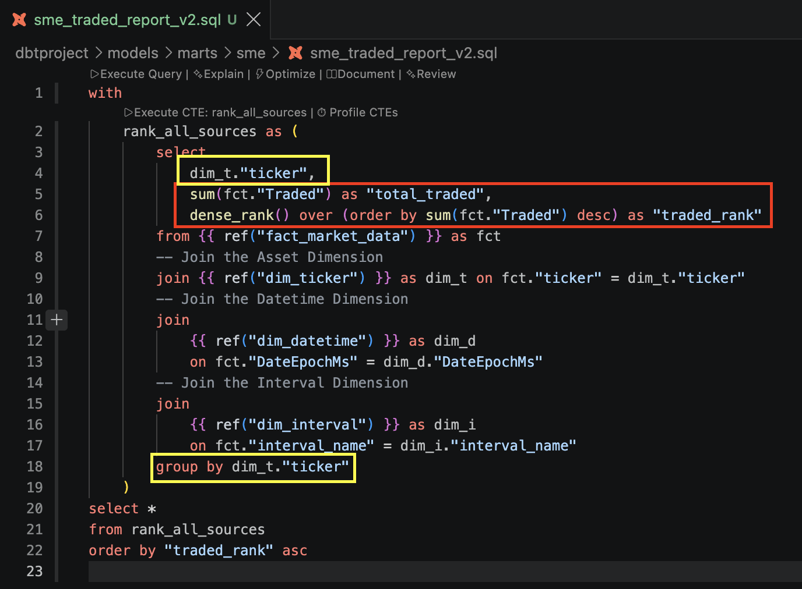
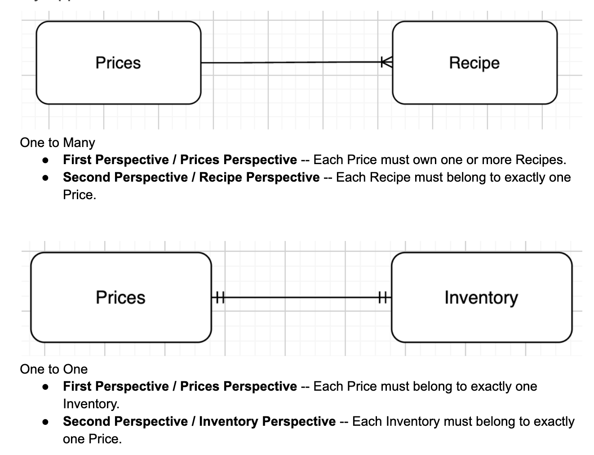
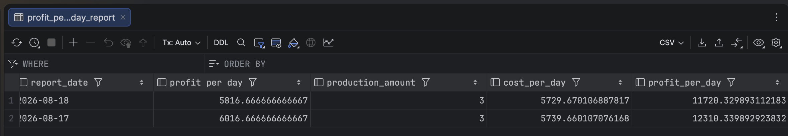
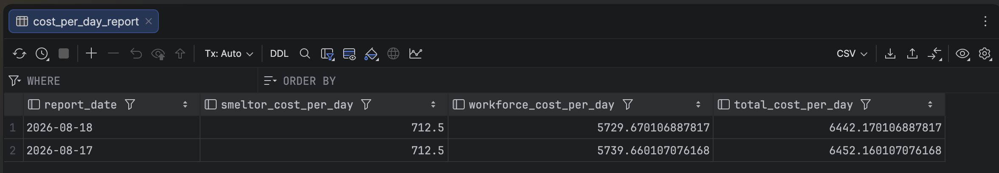
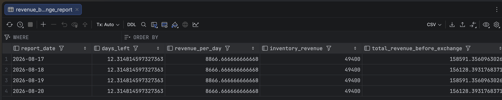
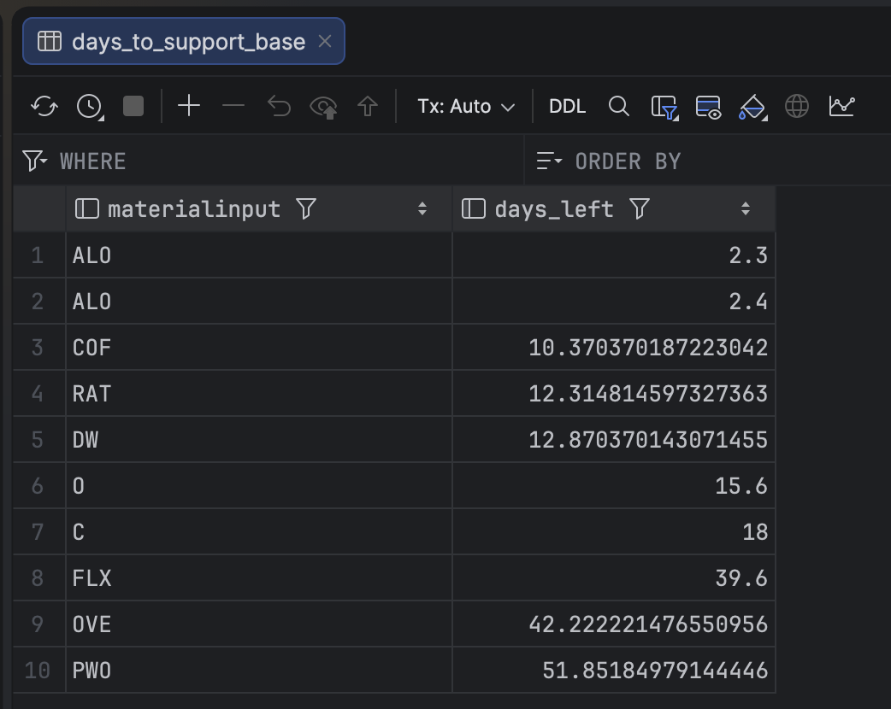
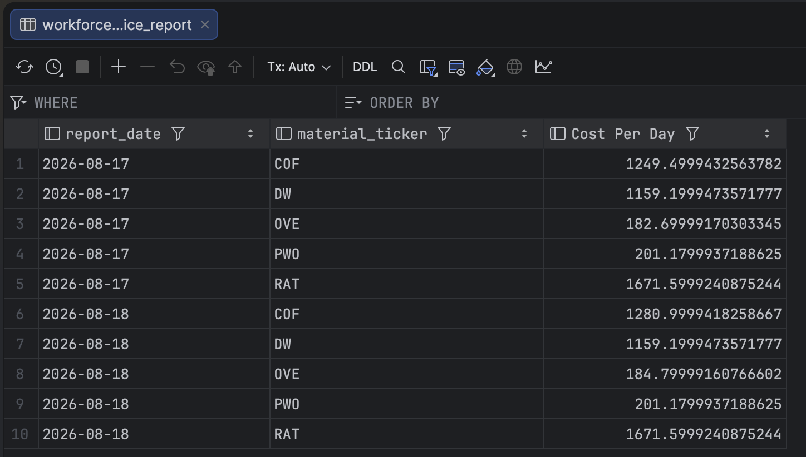
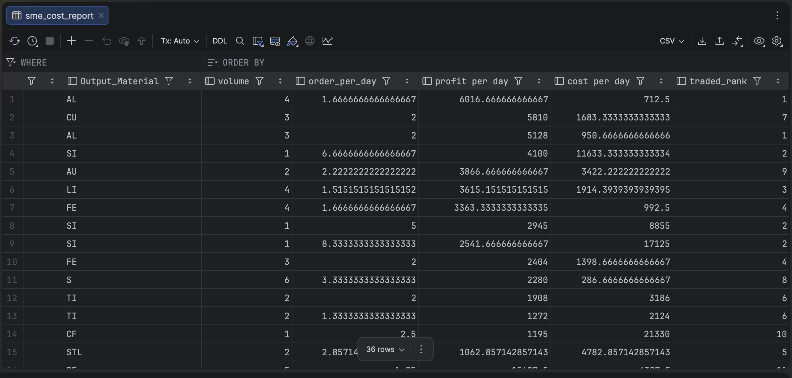

# Data-Science-Projects

# Project Highlights

[First Profitable Run](./screenshots/FirstProfitableRun.png)

[Star Schema Query](./screenshots/starSchemaQuery.png)

Fact table for aggregate function, Dimension table for where & group by clause

[Time Series Analysis](./screenshots/timeSeriesAnalysis.png)

[Identify Outlier through Standard Deviation](./screenshots/IdentifyOutlierStandardDeviation.png)

[Dagster & DBT Lineage](./screenshots/dagster&dbtLineage.png)

[Dagster & DBT Global Lineage](./screenshots/dagster&dbtGlobalLineage.png)

[Created Fact and Dimension](./screenshots/myprojecyFact&Dimension.png)

[Medallion Archictecture](./screenshots/medallionArchitecture.png)

[Defining Conceptual Relationships](./screenshots/relationships.png)

Note: When writing query the first table should the the parent table, and the join table should be the child table.
This is especially important when using joins like left join.

# Reports
## SQL Reports
[Profit Perday Report](./screenshots/profitPerDayReport2.png)

Shows daily profit minus workforce cost.

[Cost Perday Report](./screenshots/costPerDayReport.png)

Shows daily cost that consist of production cost and workforce cost, to be used to estimate cost of refilling at commodity exchange.

[Revenue Before Exchange](./screenshots/revenueBeforeExchange.png)

Shows revenue before going to the exchange, divide by daily cost to estimate plan expansion & maintainance of base.

[Days to support base Report](./screenshots/daysToSupportBaseReport.png)

Shows how long until needs to replenish supplies for base

[SME Recipe Report](./screenshots/recipe_report.png)

Shows daily which Smeltor's recipe shows the highest ROI.

[FS Recipe Report](./screenshots/fsReport.png)

Shows which Metalist Studio's recipe shows the highest ROI

[Workforce Report](./screenshots/workforcePriceReport.png)

Shows the daily cost of Workforce.  

[SME Cost Report](./screenshots/smeCostReport.png)

Shows daily Smeltor's recipe cost, to be used to estimate cost of refilling at commodity exchange.

[cxpx_al_ai_report_high](./screenshots/cxpx_al_a1_report_high.png)

Shows ticker AL (Aluminium) todays's high with previous 1st, 3rd, 6th, 9th, 12th, entire period

[cxpx_alo_ai_report_high](./screenshots/cxpx_alo_a1_report_high.png)

Shows ticker ALO (Aluminium Ore) todays's high with previous 1st, 3rd, 6th, 9th, 12th, entire period

[inventory Price](./screenshots/inventoryPrice.png)

Shows the selling price of your base inventory

[goal report](./screenshots/goalReport.png)

Shows the total buying price of 2 HB2 and 1 FS

## Excel Reports
How to bucket data guide:
https://edferrero.com/index.php/en/blog

Resource to learn more:
https://link.springer.com/book/10.1007/978-3-031-70584-7

*** Important fact, you need to consult GBT if formula will apply on reference table that is filtered ***
^
The best way is to filter the data and just put the data into a new sheet, then formula on that new sheet.

Excel Sheet: stg_cxpc_al_ai1

[First Iteration of Bucket open price](./screenshots/bucketPrice.png)

[Second Iteration of Bucket open price](./screenshots/bucketPrice2.png)

I decided to bucket (20 bucket) the chart data for AL.A1 , so because Seller Price now is 1470, and it's position is tail end of the buckets, does this mean the Seller Price will go higher / trending up? 

Question: How do know which date do I want to filter the data? So that the chart make sense, it will not be entire data because 500 to 1000 range is too low, I think
I have to find the new floor.
I guess you can create a ranking for the lowest open prices, and their dates

# Vscode extensions to download
sqlfluff to linter sql properly for best practises

# Backup Postgres docker data (Incase I lose all data at some point)
docker exec -t postgres-container pg_dump -U postgres -d prosperous_universe > ./backup_sql/backup.sql
docker exec -i postgres-container psql -U postgres -d prosperous_universe < ./backup_sql/backup.sql

# Backup with Github Actions:
git clone --depth 1 --branch v4 https://github.com/actions/upload-artifact.git .github/actions/upload-artifact
Run Backup Database workflow

# DBT Website crendentials
E4J8NLKAYRZ67GK5XWMDDKBR

# DBT Setup
Link (lastest dbt core has issue, downgrade to 1.8.0 for stable):
https://www.youtube.com/watch?v=ALuYdar1vCc&t=986s

Create schema for current docker postgres called STAGING in datagrip
- create schema staging;

Create virtual environments:
- python3 -m venv dbt-demo

Virtual environment to keep dependencies local to repo
- source dbt-demo/bin/activate

## Incase Installation went wrong
### 1. Deactivate the current environment
- deactivate

### 2. Delete the dbt-demo folder
rm -rf dbt-demo

### 3. Create a fresh virtual environment named dbt-demo
python3 -m venv dbt-demo

### 4. Activate it
source dbt-demo/bin/activate

Check if virtual environment is fresh
- pip freeze

Install dependencies
- pip install -r requirements.txt

Check dependencies
- pip freeze

Initialize dbt project
- dbt init

To check database connection is correct:
- /Users/jonathankee/.dbt/profiles.yml

Change dictory to dbtproject to run dbt commands:
- cd dbtproject

Check if connection is correct:
- dbt debug

Make dbt create table or view inside postgres:
- dbt run

Make dbt run specific model:
- dbt run --select my_first_dbt_model.sql

Make dbt download packages
- dbt deps

Make dbt test dimension and fact tables
dbt test --select dim_ticker fct_prices
dbt test --select dim_facility fct_inventory_snapshot

# DBT when making changes to incremental model
dbt run --full-refresh --select your_incremental_model_name

Question: But how do we backup the previous data before the the new columns arrive

1. Create a Quick Backup Table
CREATE TABLE raw.profit_per_day_report_backup AS
SELECT * 
FROM raw.profit_per_day_report;

2. Run the Full Refresh
dbt run --select profit_per_day_report --full-refresh

3. Migrate the Old Data to the New Table
INSERT INTO raw.profit_per_day_report (
    report_date,
    profit_per_day, -- The new column name
    production_amount,
    workforce_cost_per_day,
    total_profit_per_day
)
SELECT 
    report_date,
    "profit per day", -- The old column name mapped to the new one
    production_amount,
    workforce_cost_per_day,
    total_profit_per_day
FROM raw.profit_per_day_report_backup
WHERE report_date < CURRENT_DATE; -- Adjust this to prevent inserting duplicates

# DBT column lineage
Change dictory to dbtproject to run dbt commands:
- cd dbtproject

Run dbt to generate the required artifacts:
- dbt compile
- dbt docs generate

Generate lineage report:
- colibri generate

View results: Open dist/index.html in your browser

# Dagster UI
+group:"exchange_ingestion" or +group:"csv_ingestion" or +group:"building_ingestion" 
group:"DBT" 

# Dagster setup
Install UV (macOS and Linux)
- curl -LsSf https://astral.sh/uv/install.sh | sh

Install dagster cli
- uvx create-dagster 

Create project in current directory:
- uvx create-dagster project .

Activate project's virtual environment:
- source .venv/bin/activate

Deactivate environment:
- deactivate

Check if dagster code is correct:
- dg check defs

Materializing assets using the Dagster UI:
- dg dev

Reload dependencies:
- uv sync

See dependency graph:
- uv tree

# Use Python verions that works for project
Tell uv to target Python 3.12 for this project:
- uv python pin 3.12

Remove the current Python 3.14 environment and build a new one using Python 3.12::
- rm -rf .venv
- uv venv --python 3.12
- uv sync

Confirm your environment is now on Python 3.12:
- uv run python --version

Output should show: Python 3.12.x

# DBT variables
## Individual runs with variables
- dbt run --select recipe_table_input_aggregate recipe_table_output_aggregate --vars '{"date_part": "2026-08-10"}'
- dbt run --select recipe_table_input_aggregate recipe_table_output_aggregate --vars '{"date_part": "2026-08-15"}'
- dbt run --select recipe_report --full-refresh --vars '{"date_part": "2026-08-15"}'

## Testing with different variables
- dbt run --select recipe_table_input_aggregate recipe_table_output_aggregate recipe_report --vars '{"date_part": "2026-08-15"}'
- dbt run --select recipe_table_input_aggregate recipe_table_output_aggregate recipe_report --vars '{"date_part": "2026-08-10"}'
- dbt run --select fs_recipe_table_output_aggregate  --vars '{"date_part": "2026-08-17"}'
- dbt run --select fs_recipe_table_input_prices_from_report_aggregate  --vars '{"date_part": "2026-08-17"}' 
^
This is missing data
# Recreate Table
Run createRecipeTime.sql in sql folder

Rename the table in datagrip to "recipe_inputs_raw"

# Ingestions Assets (With Javascript)
- cd ingestion
- java -jar KotlinCLI-1.0-SNAPSHOT-all.jar "https://rest.fnar.net/exchange/cxpc/AL.AI1" "https://rest.fnar.net/exchange/cxpc/AU.AI1" "https://rest.fnar.net/exchange/cxpc/CF.AI1" "https://rest.fnar.net/exchange/cxpc/CU.AI1" "https://rest.fnar.net/exchange/cxpc/FE.AI1" "https://rest.fnar.net/exchange/cxpc/LI.AI1" "https://rest.fnar.net/exchange/cxpc/S.AI1" "https://rest.fnar.net/exchange/cxpc/STL.AI1" "https://rest.fnar.net/exchange/cxpc/TI.AI1" "https://rest.fnar.net/exchange/cxpc/SI.AI1" "https://rest.fnar.net/exchange/cxpc/RE.AI1" "https://rest.fnar.net/exchange/cxpc/SEQ.AI1" "https://rest.fnar.net/exchange/cxpc/BGO.AI1" "https://rest.fnar.net/exchange/cxpc/MFK.AI1" "https://rest.fnar.net/exchange/cxpc/BRO.AI1" "https://rest.fnar.net/exchange/cxpc/BFR.AI1" "https://rest.fnar.net/exchange/cxpc/RGO.AI1" "https://rest.fnar.net/exchange/cxpc/UTS.AI1" "https://rest.fnar.net/exchange/cxpc/BCO.AI1" "https://rest.fnar.net/exchange/cxpc/AFR.AI1" "https://rest.fnar.net/exchange/cxpc/SFK.AI1" "https://rest.fnar.net/exchange/cxpc/HCC.AI1" "https://rest.fnar.net/exchange/cxpc/BGC.AI1" "https://rest.fnar.net/exchange/cxpc/FLO.AI1" "https://rest.fnar.net/exchange/cxpc/ALO.AI1" "https://rest.fnar.net/building/HB2" "https://rest.fnar.net/building/FS" "https://rest.fnar.net/csv/prices" "https://rest.fnar.net/csv/inventory?apikey=0f11ac24-ef14-428f-8213-4438576837f4&username=jonathan_kee" https://rest.fnar.net/csv/recipeinputs "https://rest.fnar.net/csv/workforce?apikey=0f11ac24-ef14-428f-8213-4438576837f4&username=jonathan_kee"

- cd ..  
- tsc --build --clean 
- tsc --build 
- tsc && node ./build/ingestion/json/cxpcFolder.js
- tsc && node ./build/ingestion/json/buildingFolder.js

- cd dbtproject
- dbt run

# Ingestions Assets (With Python)
- cd ingestion
- java -jar KotlinCLI-1.0-SNAPSHOT-all.jar "https://rest.fnar.net/exchange/cxpc/AL.AI1" "https://rest.fnar.net/exchange/cxpc/AU.AI1" "https://rest.fnar.net/exchange/cxpc/CF.AI1" "https://rest.fnar.net/exchange/cxpc/CU.AI1" "https://rest.fnar.net/exchange/cxpc/FE.AI1" "https://rest.fnar.net/exchange/cxpc/LI.AI1" "https://rest.fnar.net/exchange/cxpc/S.AI1" "https://rest.fnar.net/exchange/cxpc/STL.AI1" "https://rest.fnar.net/exchange/cxpc/TI.AI1" "https://rest.fnar.net/exchange/cxpc/SI.AI1" "https://rest.fnar.net/exchange/cxpc/RE.AI1" "https://rest.fnar.net/exchange/cxpc/SEQ.AI1" "https://rest.fnar.net/exchange/cxpc/BGO.AI1" "https://rest.fnar.net/exchange/cxpc/MFK.AI1" "https://rest.fnar.net/exchange/cxpc/BRO.AI1" "https://rest.fnar.net/exchange/cxpc/BFR.AI1" "https://rest.fnar.net/exchange/cxpc/RGO.AI1" "https://rest.fnar.net/exchange/cxpc/UTS.AI1" "https://rest.fnar.net/exchange/cxpc/BCO.AI1" "https://rest.fnar.net/exchange/cxpc/AFR.AI1" "https://rest.fnar.net/exchange/cxpc/SFK.AI1" "https://rest.fnar.net/exchange/cxpc/HCC.AI1" "https://rest.fnar.net/exchange/cxpc/BGC.AI1" "https://rest.fnar.net/exchange/cxpc/FLO.AI1" "https://rest.fnar.net/exchange/cxpc/ALO.AI1" "https://rest.fnar.net/building/HB2" "https://rest.fnar.net/building/FS" "https://rest.fnar.net/csv/prices" "https://rest.fnar.net/csv/inventory?apikey=0f11ac24-ef14-428f-8213-4438576837f4&username=jonathan_kee" https://rest.fnar.net/csv/recipeinputs "https://rest.fnar.net/csv/workforce?apikey=0f11ac24-ef14-428f-8213-4438576837f4&username=jonathan_kee"

- cd ..  
- python ingestion/json/cxpcFolder.py
- python ingestion/json/buildingFolder.py
- python ingestion/csv/ingestFolder.py

- Run createRecipeTime.sql in sql folder
- Rename the table in datagrip to "recipe_inputs_raw"

- cd dbtproject
- dbt run
- dbt run (second time because there's a bug)

# Ingestion Assets with Compression (With Python)
- cd ingestion
- java -jar KotlinCLI-1.0-SNAPSHOT-all.jar "https://rest.fnar.net/exchange/cxpc/AL.AI1" "https://rest.fnar.net/exchange/cxpc/AU.AI1" "https://rest.fnar.net/exchange/cxpc/CF.AI1" "https://rest.fnar.net/exchange/cxpc/CU.AI1" "https://rest.fnar.net/exchange/cxpc/FE.AI1" "https://rest.fnar.net/exchange/cxpc/LI.AI1" "https://rest.fnar.net/exchange/cxpc/S.AI1" "https://rest.fnar.net/exchange/cxpc/STL.AI1" "https://rest.fnar.net/exchange/cxpc/TI.AI1" "https://rest.fnar.net/exchange/cxpc/SI.AI1" "https://rest.fnar.net/exchange/cxpc/RE.AI1" "https://rest.fnar.net/exchange/cxpc/SEQ.AI1" "https://rest.fnar.net/exchange/cxpc/BGO.AI1" "https://rest.fnar.net/exchange/cxpc/MFK.AI1" "https://rest.fnar.net/exchange/cxpc/BRO.AI1" "https://rest.fnar.net/exchange/cxpc/BFR.AI1" "https://rest.fnar.net/exchange/cxpc/RGO.AI1" "https://rest.fnar.net/exchange/cxpc/UTS.AI1" "https://rest.fnar.net/exchange/cxpc/BCO.AI1" "https://rest.fnar.net/exchange/cxpc/AFR.AI1" "https://rest.fnar.net/exchange/cxpc/SFK.AI1" "https://rest.fnar.net/exchange/cxpc/HCC.AI1" "https://rest.fnar.net/exchange/cxpc/BGC.AI1" "https://rest.fnar.net/exchange/cxpc/FLO.AI1" "https://rest.fnar.net/exchange/cxpc/ALO.AI1" "https://rest.fnar.net/building/HB2" "https://rest.fnar.net/building/FS" "https://rest.fnar.net/csv/prices" "https://rest.fnar.net/csv/inventory?apikey=0f11ac24-ef14-428f-8213-4438576837f4&username=jonathan_kee" https://rest.fnar.net/csv/recipeinputs "https://rest.fnar.net/csv/workforce?apikey=0f11ac24-ef14-428f-8213-4438576837f4&username=jonathan_kee"

- cd ..  
- python ingestion/json/cxpcFolderCompress.py
- python ingestion/json/buildingFolderCompress.py
- python ingestion/csv/ingestFolderCompress.py
In case need to reverse the process:
- python ingestion/reverseCompress.py

- Run createRecipeTime.sql in sql folder
- Rename the table in datagrip to "recipe_inputs_raw"

- cd dbtproject
- dbt run
- dbt run (second time because there's a bug)

# Ingestion Pipeline commands
cxpc_AL_AI1.json is Download from https://doc.fnar.net/#/exchange/get_exchange_cxpc__ExchangeTicker_

Rebuild typescript files:
- tsc --build --clean 
- tsc --build  

Exchange ticker json ingestion:
- tsc && node ./build/ingestion/json/cxpc.js "https://rest.fnar.net/exchange/cxpc/AL.AI1"
- tsc && node ./build/ingestion/json/cxpc.js "https://rest.fnar.net/exchange/cxpc/ALO.AI1"

Building costs json ingestion:
- tsc && node ./build/ingestion/json/building.js "https://rest.fnar.net/building/HB2"
- tsc && node ./build/ingestion/json/building.js "https://rest.fnar.net/building/FS"

Prices csv ingestion:
- python ingestion/csv/ingest.py "https://rest.fnar.net/csv/prices" 
    
inventory csv ingestion:
- python ingestion/csv/ingest.py "https://rest.fnar.net/csv/inventory?apikey=0f11ac24-ef14-428f-8213-4438576837f4&username=jonathan_kee"

recipeinputs csv ingestion:
- python ingestion/csv/ingest.py https://rest.fnar.net/csv/recipeinputs

Docker command to feed sql file into docker postgres
- cd injestion/sql
- docker exec -i -e PGPASSWORD=abc123 postgres-container psql --dbname=prosperous_universe --username=postgres < ./cxpc_AL_AI1_30072026.sql
- docker exec -i -e PGPASSWORD=abc123 postgres-container psql --dbname=prosperous_universe --username=postgres < ./cxpc_ALO_AI1_30072026.sql
^
This will truncate the existing table and insert the new data, the new data already contain historical data, so there's nothing to worry.

## Download CSV from api /csv/prices 
- cd csv
- curl -s -X GET "https://api.fnar.net/csv/prices?include_header=true" -H "accept: text/csv" -o prices.csv
- curl -X 'GET' 'https://api.fnar.net/csv/recipeinputs?include_header=true' -H 'accept: text/csv' -o recipeInputs.csv
- copy over csv file to docker container

## Test Postgres docker connection & location
- docker exec -it postgres-container sh
- docker cp \
    ./csv/prices.csv \
    postgres-container:/tmp/prices.csv
- docker cp \
    ./csv/recipeInputs.csv \
    postgres-container:/tmp/recipeInputs.csv

## Docker Postgres Import CSV File Into PostgreSQL Table
- CREATE TABLE market_depth_raw (
    "Ticker"        VARCHAR(10) PRIMARY KEY,
    "MMBuy"         NUMERIC(15, 2),
    "MMSell"        NUMERIC(15, 2),
    
    "AI1-Average"   NUMERIC(15, 2),
    "AI1-Previous"  NUMERIC(15, 2),
    "AI1-AskAmt"    NUMERIC(15, 4),
    "AI1-AskPrice"  NUMERIC(15, 2),
    "AI1-AskAvail"  INTEGER,
    "AI1-BidAmt"    NUMERIC(15, 4),
    "AI1-BidPrice"  NUMERIC(15, 2),
    "AI1-BidAvail"  INTEGER,

    "CI1-Average"   NUMERIC(15, 2),
    "CI1-Previous"  NUMERIC(15, 2),
    "CI1-AskAmt"    NUMERIC(15, 4),
    "CI1-AskPrice"  NUMERIC(15, 2),
    "CI1-AskAvail"  INTEGER,
    "CI1-BidAmt"    NUMERIC(15, 4),
    "CI1-BidPrice"  NUMERIC(15, 2),
    "CI1-BidAvail"  INTEGER,

    "CI2-Average"   NUMERIC(15, 2),
    "CI2-Previous"  NUMERIC(15, 2),
    "CI2-AskAmt"    NUMERIC(15, 4),
    "CI2-AskPrice"  NUMERIC(15, 2),
    "CI2-AskAvail"  INTEGER,
    "CI2-BidAmt"    NUMERIC(15, 4),
    "CI2-BidPrice"  NUMERIC(15, 2),
    "CI2-BidAvail"  INTEGER,

    "NC1-Average"   NUMERIC(15, 2),
    "NC1-Previous"  NUMERIC(15, 2),
    "NC1-AskAmt"    NUMERIC(15, 4),
    "NC1-AskPrice"  NUMERIC(15, 2),
    "NC1-AskAvail"  INTEGER,
    "NC1-BidAmt"    NUMERIC(15, 4),
    "NC1-BidPrice"  NUMERIC(15, 2),
    "NC1-BidAvail"  INTEGER,

    "NC2-Average"   NUMERIC(15, 2),
    "NC21-Previous" NUMERIC(15, 2),
    "NC2-AskAmt"    NUMERIC(15, 4),
    "NC2-AskPrice"  NUMERIC(15, 2),
    "NC2-AskAvail"  INTEGER,
    "NC2-BidAmt"    NUMERIC(15, 4),
    "NC2-BidPrice"  NUMERIC(15, 2),
    "NC2-BidAvail"  INTEGER,

    "IC1-Average"   NUMERIC(15, 2),
    "IC1-Previous"  NUMERIC(15, 2),
    "IC1-AskAmt"    NUMERIC(15, 4),
    "IC1-AskPrice"  NUMERIC(15, 2),
    "IC1-AskAvail"  INTEGER,
    "IC1-BidAmt"    NUMERIC(15, 4),
    "IC1-BidPrice"  NUMERIC(15, 2),
    "IC1-BidAvail"  INTEGER
);

- COPY market_depth_raw
FROM '/tmp/prices.csv'
WITH (FORMAT csv, HEADER true, NULL '');

- CREATE TABLE recipe_inputs_raw (
    "Key"       VARCHAR(100) NOT NULL,
    "Material"  VARCHAR(20),
    "Amount"    INTEGER NOT NULL
);

- COPY recipe_inputs_raw
FROM '/tmp/recipeInputs.csv'
WITH (FORMAT csv, HEADER true, NULL '');

# Sysadmin commands
ps aux | grep "dagster"

# Finance terms
 Revenue is the total amount of money a business brings in from selling its goods or services before any expenses or costs are subtracted.
 
 Here is how it compares to profit:
 Revenue (Top Line): The total money collected from sales.
 Profit (Bottom Line): The money left over after you subtract all your costs, expenses, and taxes from the revenue.
 
 Formula: $\text{Profit} = \text{Revenue} - \text{Total Costs}$