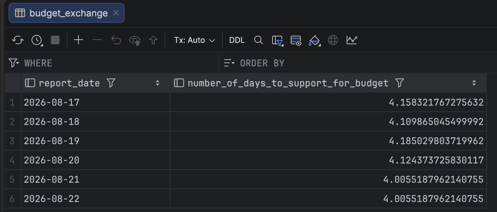
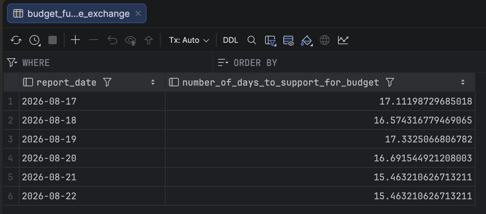

# Reports
## SQL Reports
[Profit Perday Report](./screenshots/profitPerDayReport2.png)

Shows daily profit minus workforce cost.

[Cost Perday Report](./screenshots/costPerDayReport.png)

Shows daily cost that consist of production cost and workforce cost, to be used to estimate cost of refilling at commodity exchange.

[Revenue Before Exchange](./screenshots/revenueBeforeExchange.png)

Shows revenue before going to the exchange, divide by daily cost to estimate plan expansion & maintainance of base.

[Budget on Exchange](./screenshots/budgetExchange.png)

Shows how long to sustain base on day of exchange.

[Budget on Future Exchange](./screenshots/budgetFutureExchange.png)

Shows how long to sustain base on future day of exchange.

[Days to support base Report](./screenshots/daysToSupportBaseReport.png)

Shows how long until needs to replenish supplies for base

[SME Recipe Report](./screenshots/recipe_report.png)

Shows daily which Smeltor's recipe shows the highest ROI.

[FS Recipe Report](./screenshots/fsReport.png)

Shows which Metalist Studio's recipe shows the highest ROI

[Workforce Report](./screenshots/workforcePriceReport.png)

Shows the daily cost of Workforce.  

[SME Cost Report](./screenshots/smeCostReport.png)

Shows daily Smeltor's recipe cost, to be used to estimate cost of refilling at commodity exchange.

[cxpx_al_ai_report_high](./screenshots/cxpx_al_a1_report_high.png)

Shows ticker AL (Aluminium) todays's high with previous 1st, 3rd, 6th, 9th, 12th, entire period

[cxpx_alo_ai_report_high](./screenshots/cxpx_alo_a1_report_high.png)

Shows ticker ALO (Aluminium Ore) todays's high with previous 1st, 3rd, 6th, 9th, 12th, entire period

[inventory Price](./screenshots/inventoryPrice.png)

Shows the selling price of your base inventory

[goal report](./screenshots/goalReport.png)

Shows the total buying price of 2 HB2 and 1 FS

## Excel Reports
How to bucket data guide:
https://edferrero.com/index.php/en/blog

Resource to learn more:
https://link.springer.com/book/10.1007/978-3-031-70584-7

*** Important fact, you need to consult GBT if formula will apply on reference table that is filtered ***
^
The best way is to filter the data and just put the data into a new sheet, then formula on that new sheet.

Excel Sheet: stg_cxpc_al_ai1

[First Iteration of Bucket open price](./screenshots/bucketPrice.png)

[Second Iteration of Bucket open price](./screenshots/bucketPrice2.png)

I decided to bucket (20 bucket) the chart data for AL.A1 , so because Seller Price now is 1470, and it's position is tail end of the buckets, does this mean the Seller Price will go higher / trending up? 

Question: How do know which date do I want to filter the data? So that the chart make sense, it will not be entire data because 500 to 1000 range is too low, I think
I have to find the new floor.
I guess you can create a ranking for the lowest open prices, and their dates
